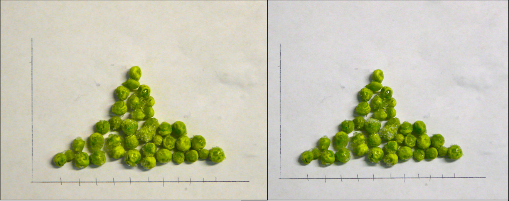
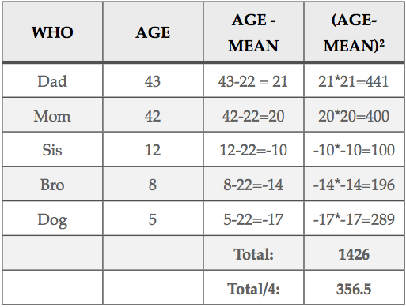
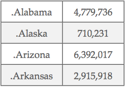
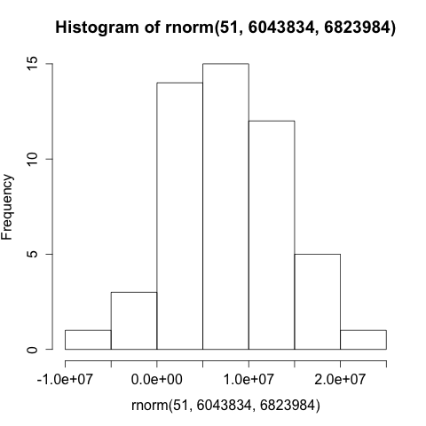

第六章：啤酒，农场和豌豆
=====================



#### 很多最简单和最实用的统计方法都来自于出生于十九世纪工业革命时期的四个年轻人。他们大部分的工作都专注于使用收集到的数据来描述观察到的现象并且做出相应的推断，应用到工业和农业生产实际中去解决问题。

十八世纪末到十九世纪初，数学和科学取得了突破性的进展。那个年代的科学家和数学家们认为只需要纸、笔和足够的时间，人类所面临的一切问题（包括人类无法突破自身局限的问题）都可以被测量、分类来重建概念，使分析变得更为有效。法兰西斯·高尔顿，卡尔·皮尔逊，威廉·戈塞和罗纳德·费雪这四个英国人成为了当时科学发展观和理想主义信念的代表。

首先要提到的是法兰西斯·高尔顿，大名鼎鼎的查尔斯·达尔文的表兄，虽然名气没有表兄大，但他也是智商超群。高尔顿是一位绅士，通晓拉丁文和希腊语，学过医学和数学，他还是一位著名的非洲探险家。他提出了“优生学”的概念，也因极力倡导优生学而为人所知。优生学是指通过人为手段对特定的人群限制生育，以改善人类基因。高尔顿研究了豌豆、兔子和人类的遗传特征，推断称我们应该奖励部分人结婚生育的行为，因为他们的后代可以改善人类种族的基因。这些观念在二战时被纳粹德国错误利用，他们认为自己是优等种族，这也成为他们惨绝人寰的屠杀理由。当然除了优生学之外，高尔顿对数学和统计学的发展也做出了重要和珍贵的贡献，特别是启发了两种如今广泛使用的基础方法：相关性分析和回归分析。

细看高尔顿的研究和理论，客观来讲他本人并不是个出色的数学家，但是他有个年轻的搭档，也就是常被认为是数理统计奠基人的卡尔·皮尔逊。皮尔逊重新处理了相关性和回归分析理论背后的数学推导，并且在数据处理方面做了很多影响至今的工作。和高尔顿一样，皮尔逊也支持优生学的理论，但他也因为影响了爱因斯坦对相对论的部分想法而获得赞扬，他还是一名早期的女权主义的拥护者。

下一位要介绍的是威廉·戈塞，一个数学和化学的奇才。他在化学方面的专业知识可能是当初他大学刚毕业位于爱尔兰都柏林的健力士精酿公司就雇佣他的原因。作为一个前瞻性的公司，健力士酿酒厂此时正寻找可以解决大批量生产精酿啤酒所带来的质量波动问题。戈塞加入公司之后提出了一种现在被称为小样本抽样的统计方法，也就是分析容量相对较小样本，得到对整体的估计结果。当然，大批量精酿啤酒是个耗时且昂贵的工艺流程，所以要想从小样本抽样分析得到对整体质量的估计，戈塞只好研究概率对在决定一批啤酒质量所起到的作用。健力士公司并不赞成他把这项研究的结果对学术界公开，无奈的戈塞用了“学生”这一最为谦虚的化名将他的方法公之于众。“学生t检验”中的“学生”就是由此而来的。

最后要介绍的这位十八世纪晚期出生的数学家是罗纳德·费雪，他同时也研究以生物和遗传学为主的科学。和高尔顿不同，费雪并不是一名富有的绅士，事实上刚结婚的他和夫人是两个靠干农活维持生计农民。在费雪的众多论文中，有一篇是在洛桑试验站投稿发表的。在洛桑试验站，他得到了关于粮食产量波动的数据。通过对这一数据的研究，费雪提出了一种非常必要的统计分析方法--方差分析。费雪还是实验设计的先驱，提出了我们在前几章提到过的要素、水平、实验组和对照组等方面内容。

当然，十九、二十世纪期间对实用统计做出贡献的数学家肯定不止以上提到的四位，但是这四位在应用数理和统计到其他科学研究方面确实颇有地位（所以“啤酒、农场和豌豆”也是一个好的章节名）。

纵观这四位的研究，问题的关键在于他们手头上能拿到的数据“样本”和可能或者的确存在的大的数据总量在数量上有很大区别。当戈塞在啤酒厂批量精酿啤酒时，他知道穷尽所有种原料配比和制备方法来获取数据是不现实的。戈塞明白他只有小批次取样分析，总结之后来推测在将来的批次可能发生的情况。这也是处理各种类型、各种容量数据时我们面临的窘境：不论你有什么样的数据，总会有更多没有被取样的数据。你可以通过改变测量和处理方法来获取数据，但未来还会有更多没有被收集到的数据，也许永远不会被收集。甚至于我们使用了完全相同的数据收集方法，但是数据却仍然会因随机性而不同。不管你有什么数据，它只是总体的快照，或者说一个样本。这让我们明白我们无法完全信任我们手上的数据；我们必须有所保留，记住在数据中总有不确定性。统计学提供了很多强大的统计工具，这些费雪们开发的实用工具帮助人们描述并量化数据中的不确定性，帮助我们了解对单一样本的信任程度。所以请记住：尽管我们可以**描述**我们手上的样本数据，但最大的挑战在于如何**推测**我们无法获取的更大的总量数据的意义。

在前面几章我们已经学习过几种描述统计学概念，下面从实际应用角度重新定义了这几种概念：

- 平均数（严格说是算术平均数）是表征数据集中趋势的一个指标。 它是由观测数据之和除以这组数据的观测个数得到的。

- 中位数也可以表征数据集中的趋势，但它不能由计算得出。可以通过把所有观察值由高到低排序后找出正中间的一个作为中位数。

- 全距，又称极差，是用来测量变异量数，也就是样本中最大值与最小值之间的差距。它是样本数据的最大值减去最小值得到的。

在这个列表中我们应该再加上三个在不同情况下会遇到的概念：

- 众数，另一个表征集中趋势的指标，指一组数据中出现次数最多的变量值。和中位数一样，众数也无法被直接计算得出。你得数出每个变量出现的个数，然后找到出现次数最多的那个作为众数。

- 方差，测量样本数据的离散程度。和全距类似的方差也描述样本的展开程度，然而与全距仅仅由最大最小数之差来描述不同，方差是各个数据与平均数之差的平方和的平均数。前面章节提到过家庭成员年龄的数据，他们的平均年龄是22岁。如果你还能想起细节，那你就能读懂如下的表格：



这个表格演示了如何计算方差：先计算各个数据与平均m数之间的偏离量，然后将差值平方（乘以自己）来消除负数偏离量的影响（比如弟弟的偏离量为-14）。然后我们求出偏离量的平方和，最后除以观察的次数来得到“平均的偏移量平方”。注意，将平方和除以4而不是5并不是一个错误，当我们在后面谈到自由度这个概念的时候你就会明白这么做的原因。这样我们就得到了方差这个应用广泛的统计概念。虽然在数学上很有用，但联系实际方差看起来并不能描述所有问题。比如在如上例子中我们看到家庭成员数据：对平均年龄有356.5“平方年”的偏离量，看起来怪怪的。平方米或许容易理解，但那是另一码事情了。所以为了结局这种尴尬，统计学家又提供了一种更容易理解的概念：

- 标准差，另一个描述离散程度的特征量，和方差联系紧密。标准差其实就是对方差开平方，消除了“平方年”这种尴尬的单位带来的困惑。在上面的例子里，标准差约是18.88年（保留两位小数，在这种情况已经足够）。

下面我们来看看在R中如何计算这些数值：

```r
> var(myFamily$myFamilyAges)
[1] 365.5
```

```r
> sd(myFamily$myFamilyAges)
[1] 18.88121
```

注意这里使用了前面章节用到的数据，还包括了使用“$”来获取数据帧的变量。如果你没有前面章节的数据，你也可以这样做：

```r
> var(c(43, 42, 12, 8, 5))
[1] 365.5
```

```r
> sd(c(43, 42, 12, 8, 5))
[1] 18.88121
```

这里例子真是很无聊，而且对后面章节的内容也没有太多用，所以下面我们换一组数据来分析。我们要使用Windows或者Mac的剪切板程序来复制粘贴一组大一点的数据到R里。进入美国统计局网站，那里存储了许多人口数据：

[http://www.census.gov/popest/data/national/totals/2011/index.html](http://www.census.gov/popest/data/national/totals/2011/index.html)

如果你有电子表格程序，点击XLS链接（“Annual Estimates of the Resident Population for the United States”）。当表格打开之后，选择五十个州的人口估算数据。前面几行数据应该想下面这样（2011年数据）：



为了使用下面介绍的R命令，请只选择数字而不是文本。在你复制数字之前，把单元格类型改为“基本”来去除逗号。通常可以在格式菜单里选择修改单元格，当然你也可以在工具栏里很容易找到相关按钮。把数字复制到剪切板中（Windows用户使用快捷键Ctrl + C，Mac用户使用快捷键command + C）。在Windows上使用如下命令：

```r
read.DIF("clipboard", transpose=TRUE)
```

在Mac电脑上使用下面代码：

```r
read.table(pipe("pbpaste"))
```

在不同类型电脑上使用不同命令很烦人，谁让微软和苹果的工程师使用不同的方法来设置剪切板呢，这种副作用无法避免，况且R又是跨平台设计，只能屈从于不同的平台采用不同的代码了。不管怎么说，你现在应该能在R的控制台看到很长一串人口数量数据输出了。光是这串数字其实没什么用，下面我们把他们放到一个向量里面：

在Windows上使用`read.DIF`:

```r
> USstatePops <- +
read.DIF("clipboard", transpose=TRUE)

> USstatePops
            V1
1   4779736
2    710231
1   6392017
...
```

在Mac电脑上使用`read.table`:

```r
> USstatePops <- read.table(pipe("pbpaste"))

> USstatePops
            V1
1   4779736
2    710231
1   6392017
...
```

这里因篇幅所限只显示前三行数据。你的R的输出应该是全部列表。注意其实这里和之前章节的不同不过是我们使用了`read.DIF()`或者`read.table()`函数来获取更大一点的不需要手动输入的数据。像`read.table()`这样的函数在今后使用R的过程中显得十分重要，因为这些函数让我们能把从外部文件存储的数据读入R的存储空间来方便数据分析。如果在使用中出现问题，你可以复制粘贴本章最后的“如果失败了”部分的命令代码来把相同的数据输入到R里。

注意我们已经使用这个赋值符号`<-`来把`read.DIF()`或者`read.table()`的结果放到了一个R数据对象中。现在你可以使用前面章节学到的`str()`和`summary()`函数来对这个新的数据对象`USstatePops`
进行练习了。你有没有发现这些函数返回的结果很有趣？你应该会发现这里有51个观测而不是50个，你知道为什么吗？如果一时想不出，你可以看看网站或者是表格里的原始数据。另外你应该会发现`USstatePops`是一个数据帧，而不是一个向量。你可以从上面的输出看出来：在第二行代码我们要求R返回`USstatePops`变量里存储的内容，R输出了一列，列名称为`V1`。因为我们没有给R跟多关于这列数据的信息，它就命名这列数据为`V1`，其实是默认的变量一（Variable One）的缩写。所以当我们想要获取这一列数据的时候，我们就可以使用`USstatePop$V1`。如果这听起来挺陌生的，那请在看一看前面“行与列”那章关于如何获取数据帧中一列的内容。

现在我们已经准备好在这个稍微大一点的数据列表上小试牛刀了。首先是对各州人口的一些描述性统计量：

```r
> mean(USstatePops$V1)
[1] 6053834
> median(USstatePops$V1)
[1] 4339367
> mode(USstatePops$V1)
[1] "numeric"
> var(USstatePops$V1)
[1] 4.656676e+13
> sd(USstatePops$V1)
[1] 6823984
```

上面的总结内容看起来很棒，但是等一下，有些返回值好像跟想象有所不同：

- `mode()`函数返回了数据向量的类型，而不是统计变量：众数。这挺怪的，但是确是对的：基础的R包其实并没有一个计算众数的函数！一部分原因是众数只在很局限的情况下有作用，但是我们在后面的章节会告诉你如何添加R的包来获取新的R函数，其中就包括计算众数的函数。

- 方差的返回值是4.656676e+13。这是在本书中我们第一次看到R中使用科学计数法。如果你以前没看过这种计数方法，没关系，你可以这么想：把4.656676乘以10000000000000（也就是10的13次方）。这个数太大了，而且写起来很累，所以使用科学记数法很省事。如果你不想在计算器上按照科学计数法来输入，还有一个窍门就是把小数点向右移13位。

除了这两点，我们现在知道美国各州人口平均数为6053834，标准差为6823984。你可能会想标准差接近七百万意味着什么？平均数和标准差的数值都没问题，而且他们还十分精确，但是对我们大多数人来说，用一张图来展示这种数据集中趋势和离散程度会更为直观。那么我们就来画一张直方图。运行如下代码：

```r
hist(USstatePops$V1)
```

在图片输出那里你应该能看到如下图片


统计直方图专门用来显示“频率”的条形统计图表。频率在这里指在一个数据集合中一个特定的数值或者数值空间出现的次数。上面的直方图很有趣，大约有30个州人口不足500万，另外有10个州人口不到1000万，剩下很少一部分州人口超过1000万。那么我们到底该如何从统计图表中提取这些信息呢？首先顺着Y轴（左面垂直的轴线）读取频率信息。最高的竖长条就在Y轴右侧，最高点接近Y轴的标记30。顺着X轴（底部水平的轴线）可以读出这个竖长条所表示的内容了，注意到每两个竖长条之间就会有一个X轴的科学计数标记，第一个是1e+07，也就是1000万.所以每出现一个新的竖长条（或者没有数据）代表人口增加500万。知道X，Y轴标记代表的意义之后就很容易推断出大约有30个州人口不足500万这个结论了。

如果你考虑总统选举，或者学校或者公司的地址，或者一个美国的州和世界上其他国家的比较，你得知道美国有两个特别大的州，以及一群特别小的州。当你能熟练阅读直方图之后，这些信息就会一目了然了。

另一个角度来说，这张统计直方图还有点不尽如人意。有超过50个州都挤到最前面几个竖长条里了，这其中应该还有许多我们想知道的隐藏信息。我们可以通过改变竖长条的个数来揭示这些隐藏的内容。在刚刚画的那张图种，一共有8个直方长条，那么为什么R会选择8呢？

答案就在于`hist()`函数有自己默认的计算长条数量的算法，观测数量、数据的分布以及空缺的区间都被这个算法考虑在内。幸运的是我们可以通过调整`breaks`这个参数让R调整直方长条的数量，就像下面的代码：

```r
hist(USstatePops$V1, breaks = 20)
```


这样X轴每两个标记之间就会有5个直方长条，或者说每个直方长条代表了200万的人口增长。那么新得到的这个直方图还是告诉我们以前一样的信息：有15个州的人口低于200万。这种图样表示了一种统计分布，从左开始有很高的频率，然后向右迅速跌落。你可以称这种分布为“倒J”分布，因为它的形状很像倒下来的英文字母“J”。统计学中，这种分布被称为帕累托分布（以意大利经济学家维弗雷多·帕雷托命名）。现在我们不必太过纠结为什么这种分布符合帕累托分布，但是我们可以猜测为什么会出现这样的分布图样。首先每个州的人口数量都是正数，不会出现零或者负人口，否则也不太合情理了。那么一个州总得有些人住，而且如果你回顾美国历史，每个州都起源于有人居住的殖民地或者领地。换个角度想，是什么因素导致某些州拥有巨大人口的呢？首先你得有足够的土地，然后有足够吸引人们搬到这个州或者在这个州出生的原因。同时也有很多制约人口增长的因素：罗德岛地盘小装不了太多人口，阿拉斯基尽管地盘挺大，却因为太冷了很少有人愿意搬过去。所以每个州刚开始的时候人口都挺少的，随着时间推移人口数量有所上升，但很难增长太多。因此，在这个分布中大多数个案都聚集在靠近Y轴的区域，只有很少一部分能不断增长，成为人口大州。在这些州中，有只能有极少的几个州人口能接近4000万，事实上只有一个州实现了这个目标。顺带问一句，你知道或者你能猜出这个超级大州是哪个州吗？

除了帕累托分布，还有许多其他的分布图样。最普通的也是大家最常听说的是“钟”形分布，因为分布的曲线长得像钟。统计学中，这种分布被称为正态（常态）分布。“常态”这个词是卡尔·弗里德里希·高斯（1777-1855）第一次提出的，也许他当时认为当人们研究自然现象的时候，这种分布最为典型，在常态下最容易发生。下面的直方图就体现了这种典型的钟形正态分布图样。



如果你很好奇，你就会想到底R是怎么弄出上面这个直方图的呢？而且如果你仔细观察，你就会发现这张图里有好几处都出现了"rnorm"这个词。其实这个R另外一个很棒的功能：当正在解决问题或者做展示的时候，可以轻易利用R生成”假“数据来辅助说明。上面直方图所使用的数据是R中的`rnorm()`函数随机生成的，这些数据被用来拟合图示的正态分布（数据越多图样越接近正态分布）。更多对`rnorm()`命令的解释有助于理解这一过程，如果你还记得上面用到的美国人口数据，平均数是6043834，标准差是6823984，使用下面的命令就能得到刚才的正态分布直方图：

```r
hist(rnorm(51, 6043834, 6823984))
```

这里要介绍两个很重要的概念。一是嵌套函数：`rnorm()`函数生成了用来绘制直方图的随机“假”数据，`hist()`函数利用数据生成对应的直方图（要加倍注意括号的位置）。R先运行里面的函数`rnorm()`，生成的数据直接并且立即传送给`hist()`函数绘图。

还有个重要概念是在“传送”到`rnorm()`函数里的“参数”。其实在刚才我们调用`read.DIF()`和`read.table()`的时候就已经在使用函数参数的概念了，只是我们没有提出来。计算机科学家常使用“参数”来告诉函数一些帮助他们明白如何运行的附加信息。在这个例子里，我们传递了三个参数给`rnorm()`：生成假数据的观察个数、分布的平均值和标准差。`rnorm()`函数使用了这三个参数来生成51个随机数据点，这些数据粗略来说可以拟合一个正态分布。因此直方图里面的数据其实是利用“假”数据来演示按照正态分布的51州人口数据的形态。

在应用统计学中，正态分布被广泛用于比较。如果你看一下刚才那张正态分布直方图中最右面的那个直方长条，它旁边的那个标签是3e+07，或者说3000万。我们从真实的人口数据中得到的结论是只有一个州的人口超过了3000万（如果你还没查，那个州是加利佛尼亚州）。所以如果有个人告诉你他（她）们州人口有3000多万，但他（她）不住加州，那么你自动联想：“这不太正常的啊，我不确定这值得相信”。你不相信的原因就是你有个分布函数用来作对比。特殊分布函数不仅仅拥有一个特征形状，而且有一个中值点（平均值）和一个分布空间（标准差）。拿到了这三个信息，你有拥有了对比数据的武器。

下一张我们会做一些上述提到的数据对比分析，看看我们能基于现有数据的子集（统计学家称为样本）来推断整体的关系。

#### 本章挑战

这一章我们使用了`rnorm()`函数来生成一系列近似拟合正态分布的数据。我们也知道了人口数据是帕累托分布。查一查那种R函数可以生成近似拟合帕累托分布的随机数据。然后传递正确的参数到该函数生成51个随机数据（提示：可以尝试不同的概率值）。利用这些数据绘制直方图，并描述分布的形状。

#### 参考资料


[http://en.wikipedia.org/wiki/Carl_Friedrich_Gauss](http://en.wikipedia.org/wiki/Carl_Friedrich_Gauss)

[http://en.wikipedia.org/wiki/Francis_Galton](http://en.wikipedia.org/wiki/Francis_Galton)

[http://en.wikipedia.org/wiki/Pareto_distribution](http://en.wikipedia.org/wiki/Pareto_distribution)

[http://en.wikipedia.org/wiki/Karl_Pearson](http://en.wikipedia.org/wiki/Karl_Pearson)

[http://en.wikipedia.org/wiki/Ronald_Fisher](http://en.wikipedia.org/wiki/Ronald_Fisher)

[http://en.wikipedia.org/wiki/William_Sealy_Gosset](http://en.wikipedia.org/wiki/William_Sealy_Gosset)

[http://en.wikipedia.org/wiki/Normal_distribution](http://en.wikipedia.org/wiki/Normal_distribution)

[http://stat.ethz.ch/R-manual/R-devel/library/utils/html/read.table.html](http://stat.ethz.ch/R-manual/R-devel/library/utils/html/read.table.html)

[http://www.census.gov/popest/data/national/totals/2011/index.html](http://www.census.gov/popest/data/national/totals/2011/index.html) 

[http://www.r-tutor.com/elementary-statistics/numerical-measures/standard-deviation](http://www.r-tutor.com/elementary-statistics/numerical-measures/standard-deviation)

#### 本章使用的R函数

`read.DIF()`        将数据读入可交换模式
`read.table()`      从外部资源将数据读入数据表格
`mean()`            计算算术平均数
`median()`          找到一组数据的中位数
`mode()`            返回数据对象的数据类型
                    注：**不返回**统计众数
`var()`             计算样本方差
`sd()`              计算样本标准差
`hist()`            绘制统计直方图

#### 自我测试

#### 如果失败了

如果你在使用`read.DIF()`或者`read.table()`时遇到困难，下面的代码可以被复制粘贴（如果不能就只好手动输入）到R的控制台，来生成本章需要使用的数据。

```r
V1 <- c(4779736,710231,6392017,2915918,37253956,5029196,3574097,897934,601723,18801310,9687653, 1360301,1567582,12830632,6483802,3046355,2853118,4339367,4533372,1328361,5773552,6547629,9883640,5303925,2967297,5988927,989415,1826341,2700551,1316470,8791894,2059179,19378102,9535483,672591,11536504,3751351,3831074,12702379,1052567,4625364,814180,6346105,25145561,2763885,625741,8001024,6724540,1852994,5686986,563626)

USstatePops <- data.frame(V1)
```


