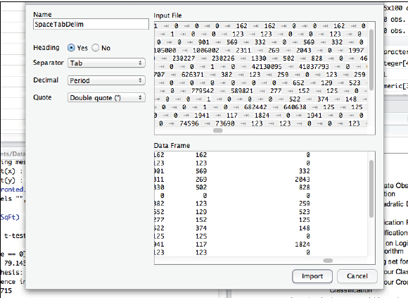

# 第十四章:储存之战


<center>

</center>
----

到目前为止，我们只使用了一些自己输入的小量的数据，或是从Twitter采集的较大量的数据。但是，我们的世界是由各种数据源构成的，我们需要了解如何把各种数据源的数据导入到R之中，或是如何在R中能够对其进行操作。在本章中，我们来看看数据的不同储存方式，以及如何使用这些数据。

很多观察过近几十年的科技发展的人都会记得，曾几何时，储存设备昂贵如金。但是，仅仅在过去的几年中，越来越快的摩尔定律让储存变得"微不足道"。尽管这种现象给我们了很多机会，但是也意味着人们会长期的保存数据，因为删除数据没什么意义，并且人们会用各种不同方式来保存数据。由于人们的这种行为，整个世界充斥着不同格式的数据，其中一些还是由诸如SAS之类的公司自行设计并独自拥有的，另外一些数据是类似于CSV（逗号分隔值）这种普通但非常有用的格式的。

事实上，一个用来划分数据格式的基本方法是看数据的可读性。那些对人类来说可读性很差的数据格式，通常被称为二进制格式，在每千字节能储存多少数据方面是很高效的，但是人们却无法直观的看到数据到底是什么样子，这确实是很怪异的。如你所想，可读性好的数据格式在存储效率上并不占优，但是在程序出现问题时却容易判断是哪里不对了。对于数据量很大的应用领域，比如信用卡处理程序，各个系统之间的数据交换几乎都是以二进制格式储存的。当某数据集被存档用来之后的重新使用，比如政府数据向公众开放时，这些数据经常是以多种格式提供的，而且至少有一种是要具备良好的可读性的。

另一个划分数据格式的方法，是根据数据是自有的还是开放的。用来储存和分享小数据集的常见方式之一就是微软Excel电子表格。尽管此格式是微软公司独自拥有的，但是Excel也是非正式意义下的普遍存在的标准格式。有很多不同的软件都可以读取Excel格式（对于不同版本的Excel，其存储的数据格式也不尽相同）。相反，开放文档格式是由一个标准协会管理的一种开放格式，人们可以放心使用数据，而无需任何担忧。开放文档格式是基于XML，即可扩展标记语言的。关于XML的讨论可以扩展成一个完整的主题，但是简而言之，XML就是一个既满足人类可读又满足机器可读的用于互联网数据交换的数据存储格式。XML由W3C标准管理，W3C是开发和维护互联网的众多标准和协议的负责方。

作为一个有众多贡献者的开源程序，R提供了大量的与外部数据连接的方法。这种便捷性是一把双刃剑。使用R，你可以获取几乎任何格式的数据，但是同时你还要从令人头昏眼花的众多选项中进行设定，这通常是不那么容易的。我们将使用两种不同的方法来解决这个问题。在本章的前半部分，我们先探索一下读入现存的数据集的方法。这些数据有时是保存在本地计算机上，有时是在互联网上，但是无论数据保存在哪里，它们都是储存在一个单独的文件中。处理这种问题的关键技巧，在于能够选择正确的命令将数据导入到R中。在本章的后半部分，我们考虑一种不同的导入数据方式，即连接到一个非文件存储的数据源。很多数据源，尤其是数据库是以系统的形式存在的，而不是以文件的形式存在。该系统能够提供某些方法来访问或查询数据，但是从用户和R的角度来讲，这些数据并非以文件的形式存在。

最简单的也是首要的向R中导入数据的方法是通过R-Studio的对话框。在R-Studio的右上方的面板中，"Workspace"（工作空间）标签页可以展示当前可用的数据对象，同时我们也可以使用上面的一系列按钮来管理工作空间。其中有一个选项是"Import Dataset"（输入数据集）：点击此按钮可以激活一个下拉菜单，其中有"From Text File..."（从文本文件中）按钮。如果你点击了这个选项并且选择了一个合适的文件，你会看到类似于如下的屏幕：

<center>

</center>

最重要的选项都在左边。"Heading"选项用来区分文件的第一行是不是变量名。"Separator"下拉菜单会给出各种不同的分割文件中各列的可选字符。R-Studio会通过扫描文件中的数据来猜测什么分隔符最合适。在本图的例子中，R-Studio正确地选择了"tab-delimited"（制表符）作为分隔符。如上所述，制表符和逗号分隔符是两种最常用的用来交换数据的格式。下面的下拉菜单是"Decimal"（小数），这个选项用来区分小数点使用什么字符，比如美国使用圆点作为小数点，而欧洲和其他地方可能会使用逗号。最后，"Quote"下拉菜单控制用来引用字符串或者文本的引号。最常用的就是双引号（double quotes）。

当然，我们在这里跳过去了一些内容，因为我们假设你已经有一个格式合适的数据文件了。举一个可读性好的数据例子可能会帮助理解：

Name,Age,Gender  
"Fred",22,"M"  
"Ginger",21,"F"  

以上是一个简单的逗号分隔的文件，第一行包含了"header"，即包含了变量的名字。第二行和后面的行包含了实际的数据。每个字段之间都用逗号分割，且文本字符串是用双引号包含的。同样的数据文件，如果用制表符分割则会看上去像是：

<left>
<table>
   <tr>
      <td>Name</td>
      <td>Age</td>
      <td>Gender</td>
   </tr>
   <tr>
      <td><left>"Fred"</td>
      <td><left>22</td>
      <td><left>"M"</td>
   </tr>
   <tr>
      <td><left>"Ginger"</td>
      <td><left>21</td>
      <td><left>"F"</td>
   </tr>
</table>
</left>

虽然你看不到屏幕上的制表符，但是每两个值之间的确有一个制表符。在以上两种情况中，无论是逗号分隔还是制表符分割，每一行数据都代表一个个案。每一行以一个不可见的换行符结束。在不同的操作系统中，你可能会遇到对表示每一行结尾的字符的不同编码方案。

包含有以逗号或制表符分割的数据在网上无处不在，但是有时我们更倾向于直接获取二进制文件。有很多R包可以用来获取二进制数据。以下的链接是一个总结：

[http://cran.r-project.org/doc/manuals/R-data.html](http://cran.r-project.org/doc/manuals/R-data.html)

这个页面展示了如何用多种方法从不同的程序和格式中获取数据。由于Excel被广泛用于处理小规模的非正式数据，我们决定使用Excel格式的数据来举例说明使用R来获取二进制数据的强大功能和某些陷阱。接近该页的底部有几段关于如何通过R获取Excel文件的讨论。事实上，第一句提到了在R中最常被提到的问题就是如何用R来获取Excel数据。

有趣的是，正是在读取Excel数据的便捷性这一方面，Mac和Linux用户是不如Windows用户的。这可能因为Excel本来就是微软产品，设计的目的是和Windows兼容，因此创造一些对Windows有效的工具非常容易。一个需要注意的例子是RODBC包。缩略词ODBC意为开放式数据库连接(Open Database Connection)，并且这是一个在各种Windows程序之间交换数据的Windows设备。尽管Mac也独自拥有一个ODBC驱动，但是大多数Mac用户更倾向于使用另外的方法来获取Excel数据。

另一个仅针对Windows的R包是xlsReadWrite。这个包能够方便地使用单个命令就能从Excel工作簿导入数据，还能够将数据导出到Excel工作簿中。另外，该包还有更详细的命令用于控制工作簿中单独的某个单元。

另外两个对Mac有效的包，xlsx和XLConnect，在本书撰写之时有版本不兼容的问题，这使得Mac用户无法将其直接安装到R上。虽然大多数R包都提供了源代码，因此理论上可以对这些源代码进行编译，从而生成出你自己的安装包，但是这种方法及其耗时，所以并不实际。

幸运的是，一个叫做gdata的用来管理数据的R包能够提供读取Excel工作簿数据的基础功能。在下面的例子中，我们将使用gdata包从网页中直接读取Excel数据。gdata包里有很多不同类型的读取和管理数据的函数，这有点“瑞士军刀”的意味。例如，你可能还记得R中使用“NA”来表示缺失值。但是我们经常会遇到数据集中包含了其他数值用来表示缺失值的情况，比如999。gdata包里有一些函数可以发现这些值并将其转换为和R的策略相符的缺失值。

首先使用install.packages()和library()函数来安装并调用gdata包：


```r
install.packages("gdata")
# ... lots of output here
```


```r
library("gdata")
```

```
## gdata: read.xls support for 'XLS' (Excel 97-2004) files ENABLED.
## 
## gdata: Unable to load perl libaries needed by read.xls()
## gdata: to support 'XLSX' (Excel 2007+) files.
## 
## gdata: Run the function 'installXLSXsupport()'
## gdata: to automatically download and install the perl
## gdata: libaries needed to support Excel XLS and XLSX formats.
## 
## Attaching package: 'gdata'
## 
## The following object is masked from 'package:stats':
## 
##     nobs
## 
## The following object is masked from 'package:utils':
## 
##     object.size
```

当然你也可以使用我们前几章开发出来的EnsurePackage()包，但是在此使用library()函数调用该包并查看输出结果是很重要的。注意到gdata包给出了它能够支持的不同版本的Excel的诊断报告。注意到这是二进制数据格式，尤其是那些大公司自营的格式的最大的缺点之一：你必须确保你拥有正确的软件来获取你可能遇到的不同版本的数据。在本例中，从输出结果可以看出，我们可以处理Excel(97-2004)的早期版本，也可以处理Excel(2007+)的近期版本。我们必须时刻警惕，在遇到更加近期的Excel版本时，gdata或其他包可能会不支持。

既然已经安装好了gdata包，我们就可以使用包中含有的read.xls()函数来读取数据了。gdata包以及read.xls()函数的文档在下面的链接中：

[http://cran.r-project.org/web/packages/gdata/gdata.pdf](http://cran.r-project.org/web/packages/gdata/gdata.pdf)

通过对文档查看，我们可以发现该函数唯一需要的参数就是XLS文件的位置，这个位置参数可以填写路径，http网络地址，或者ftp网络地址(文件传输协议，file transfer protocal，是一种不通过浏览器来发送和接收文件的方法)。如果你回溯本书非常靠前的某一章，你可能会记得我们获取了一些美国各州人口的普查数据。在本例中，我们将使用read.xls()函数直接从Excel文件中读取数据，并将其保存到一个数据框中：


```r
testFrame<-read.xls("http://www.census.gov/popest/data/state/totals/2011/tables/NST-EST2011-01.xls")
```

最前面几行的命令包含了real.xls()函数要读取的Excel文件所在的URL地址。接下来的几行输出说明了该函数尝试打开URL地址，成功打开，并下载了30Kb的数据。

下面，让我们看看刚刚都得到了什么数据。在R-Studio中，我们在右上方的数据面板中点击该数据框的名字：


```r
View(testFrame)
```

上述任何一种方法都可以在R-Studio的左上方面板中展示该数据框的内容。另外，我们可以使用str()函数来生成testframe数据框结构的汇总：


```r
str(testFrame)
```

```
## 'data.frame':	65 obs. of  10 variables:
##  $ table.with.row.headers.in.column.A.and.column.headers.in.rows.3.through.4...leading.dots.indicate.sub.parts.: Factor w/ 65 levels "",".Alabama",..: 62 53 1 64 55 54 60 65 2 3 ...
##  $ X                                                                                                           : Factor w/ 60 levels "","1,052,567",..: 1 59 60 27 38 47 10 49 32 50 ...
##  $ X.1                                                                                                         : Factor w/ 59 levels "","1,052,567",..: 1 1 59 27 38 47 10 49 32 50 ...
##  $ X.2                                                                                                         : Factor w/ 60 levels "","1,052,528",..: 1 60 21 28 39 48 10 51 33 50 ...
##  $ X.3                                                                                                         : Factor w/ 59 levels "","1,051,302",..: 1 1 21 28 38 48 10 50 33 51 ...
##  $ X.4                                                                                                         : logi  NA NA NA NA NA NA ...
##  $ X.5                                                                                                         : logi  NA NA NA NA NA NA ...
##  $ X.6                                                                                                         : logi  NA NA NA NA NA NA ...
##  $ X.7                                                                                                         : logi  NA NA NA NA NA NA ...
##  $ X.8                                                                                                         : logi  NA NA NA NA NA NA ...
```

最后的几行输出很像是对上世纪60年代的“Na Na Hey Hey Kiss Him Goodbye”的追忆。不谈这些NA们，该数据框总体的的结构是65个观测，10个变量，表示工作簿中含有65行10列数据。变量的名字多少有些疯狂，第一个变量的名字是：

"table.with.row.headers.in.column.A.and.column.headers.in.rows.
3.through.4...leading.dots.indicate.sub.parts."

这个变量名简直是一团糟！很明显，read.xls()将工作簿左上角的单元格当作变量标签了，但是该单元格的内容仅是工作簿的说明注解（真正的变量标签在工作簿的第二行）。随后的变量名包含了X，X.1和X.2：很显然，read.xls()函数在读取变量名时并不顺利。

另一个让人烦恼的事情是str()函数将所有的数据都转换为因子了。这表明R并未将读取的数据看作数字，而是当作字符串，而R是将字符串默认转化为因子的。这些读取过程中的副作用，是由于read.xls()首先读取的某些单元格是文本而不是数字产生的。数字在工作簿中的位置比较靠后。这也强调了我们需要将数据以更加有规律的结构的格式输出，例如CSV格式，而不是使用原始的工作簿格式输出。如果我们想要将这些数据以表示人口的数值格式使用的话，我们需要做一些事情。

首先，我们将使用一个小技巧将不需要的内容去掉。普查局在工作簿的前三行中放入的内容，我们可以如下去除：


```r
testFrame<-testFrame[-1:-3,]
```

方括号中的负号代表需要从数据框中删除的行号。因此符号 -1:-3 能够将前三行删除。我们将选择列的标识符空置，以便能够保留所有的列。所以方括号中的符号表示的是第一行到第三行被删除，其余的行均保留，所有的列也均保留。我们将处理后的结果再赋值给原数据框，这样就得到了一个更小的、更干净的数据框版本。

下一步，我们知道用read.xls()读取的十个变量中，只有前五个对我们有用（剩下的五个看起来都是空数据）。因此，下面的命令用来保留数据框的前五列：


```r
testFrame<-testFrame[,1:5]
```

用同样的方法，tail()函数向我们展示了数据框的最后几行也是包含了普查局对数据的一些注解：


```r
tail(testFrame,5)
```

因此我们可以安全的删除这些行：


```r
testFrame<-testFrame[-58:-62,]
```

如果你留意到刚才的这些操作，你会发现一些命令是可以合并的，但是为了让阐述更清楚，我们对每个步骤都是单独操作的。最后的结果（你可以在R-Studio的右上方面板点击查询）是一个拥有57行5列的数据框。现在我们可以执行一些数据变换了。在这之前，让我们先给第一列重新命个更好的名字：


```r
testFrame$region <- testFrame[,1]
```

下一步，我们可以按需变换格式和数据类型。我们可以用str_replace()去掉州名变量前的点：


```r
testFrame$region <- str_replace(testFrame$region,"\\.","")
```

别忘了str_replace()函数是stringr包的一部分，你需要提前用install.pacckages()和library()来加载该包。上面两个字符串表达式中的双反斜线符号被称为“转义字符”，其作用是让后面的点号能够以句点的方式被匹配，而不是以通配符的形式。句点就其本身而言是用来匹配任何字符的通配符。

下面，我们可以使用str_replace_all()和as.numeric()将人口所在列的数据转换为可用的数值形式。回忆一下这些列现如今已经用R的因子来表示了，而我们要做的就是将因子的标签去掉（这些标签为形如"308,745,538"的字符串）并且将其转换为数字。我们通过创建自己的函数可以将这些重复性的工作来轻松处理：


```r
# Numberize() - Gets rid of commas and other junk and
# converts to numbers
# Assumes that the inputVector is a list of data that
# can be treated as character strings
Numberize <- function(inputVector)
{
# Get rid of commas
inputVector<-str_replace_all(inputVector,",","")
# Get rid of spaces
inputVector<-str_replace_all(inputVector," ","")
return(as.numeric(inputVector))
}
```

这个函数很灵活，在于其可以处理不必要的逗号和空格，还可以将字符串转换为数字，而不管其是否为整数（就是说，很有可能在小数点后还有数字）。因此我们可以将上述代码运行几次，来生成一些数据框中的新数字变量：


```r
testFrame$april10census <-Numberize(testFrame$X)
testFrame$april10base <-Numberize(testFrame$X.1)
testFrame$july10pop <-Numberize(testFrame$X.2)
testFrame$july11pop <-Numberize(testFrame$X.3)
```

另外，数据框的新列的名字是基于read.xls()读取的原始数据的。你可以（且应该）确认数据框的新列是数值类型的。你可以使用str()函数来完成这个操作。

我们已经花费了半章的篇幅来实现从外部文件（或者是网络上的，或者是本地的）读取数据。我们的大部分时间是用来将得到的数据进行调整以便后面的分析使用。于此有非常重要的一点（或许是两点）。一个对数据科学家来说很重要的且费时的事情是确保数据“对目标适合”。我们使用R能够仅凭一个简单的命令就能从网上直接读取漂亮的数据集，然而使这些数据能够真正进入使用还需要一些额外的步骤。

另一个相关的话题来源于，将这些操作尽可能的自动化是非常重要的。所以当我们看到数字都以因子标签的形式存储时，我们很快就建立了自己的函数来转换这些数字的类型。这不仅仅能节省很多后续的输入工作，还能阻止在此过程中的一些错误。

