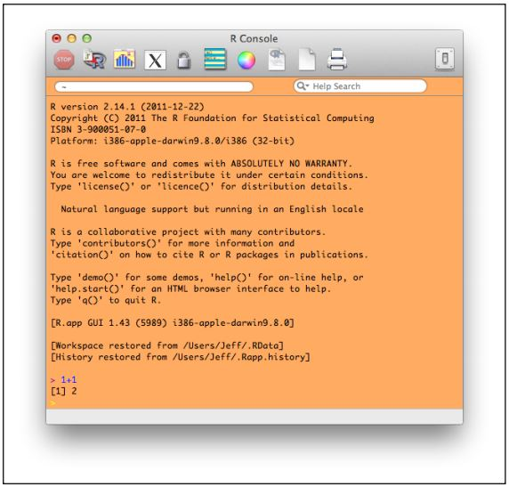

# 第三章 R入门
<center></center>
“R”是一个开源软件程序，由一群正在使用它的科学家，研究员和数据分析师们自愿服务来对它进行维护。“R”是免费下载和使用的，而且在线提供大量的建议和指导资源帮助用户学习R，这一点是非常好的，因为R是一个非常有力的和复杂的程序，现实中，它是一个专注于数据分析的功能全面的编程语言。


如果你对计算机，编程或者数据科学一无所知，那么欢迎来到这个令人兴奋的章节，这里能够帮你开启大门，认识到全宇宙中有史以来最有力的免费数据分析工具，不是说笑哦。反过来，如果你熟悉电子表格，统计分析或者会计软件，你可能会觉得这本书已经走向极端，永远不会恢复理智，而所有的这些对于用户接口设计来说都是有益的和正确的。这两个观点都是合理的。R这种开源的数据分析程序是非常有力的，灵活的和扩展性极强的（意味着人们可以很容易地为它创建新的性能）。同时，R是面向“命令行”的，就是说大量的工作和需求行为只需通过几个精心设计的命令便可以实现，其中的大部分命令是有技巧的（设计命令的标点和相关的规则是奏效的）。另外，当结果看起来有点奇怪时，R不能很正确地返回反馈或错误信息用以帮助用户修复错误或者找出问题所在。

但是还是有方法来对付这种疯狂的行为的。R作为一个教学工具的最大的一个优点是它透明度比较高。因为成功的学习者可定能够充分理解到“数据情况”是什么或者哪些R命令不能够工作。在电子表格当中，我们很容易键入大量的数和公式，比如 =FORECAST()，然后结果就会像魔法一般跳进格子里，无论这些数字或者公式有无意义。使用R，你必须理解你的数据，知道自己怎么利用这些数据，清楚这些数据时怎么被转化的，明白怎么查找问题。因为R是一门编程语言，它也会要求用户通过数据对象和能够应用到这些对象的方法，还有能够应用到这些方法的过程来思考问题。
在现代的编程语言当中有几个比较重要的隐喻，如果对软件编程，测试和集成到一个工作系统的过程没有一个基础的了解，没有数据科学家能够通往成功。R强大的扩展性能能够让志愿者们随时为它添加新的模块。R是首批集成直接从“推特”社交媒体平台提取数据的功能的分析程序。所以你可以确信下一代伟大的发展埋伏在数据的世界当中，在R社区当中的某个人开始为R所需要的模块开发新的“包”。最后，用R工作的人会慢慢体会到：R无所不能，它几乎能应用到任何其他语言和兼容其他平台。如果一个人掌握了R语言，那么他很容易就能掌握SAS(r);(统计编程语言)和SPSS(r);语法。（SAS和SPSS是两个目前最受欢迎的商业统计分析程序）。所以学校，老师和学生无需支付任何版权费便能学习到世上最强大的数据分析系统及其课程，无论你身处何地。但是它需要你有耐心，所以请你一定要坚持。

让我们开始吧。显然你需要一台计算机。如果你在使用平板电脑或智能手机，你可能想跳转到R-studio的章节，因为旧版R还没有支持在平板电脑上工作（但是有一个适合平板电脑的工作区叫做R-studio）。有少数人开始使用基于Web界面的R，像这个 <a href="http://dssm.unipa.it/R-php/R-php-1/R/" title="http://dssm.unipa.it/R-php/R-php-1/R/">http://dssm.unipa.it/R-php/R-php-1/R/</a> -但是他们仍然在初始阶段。如果你的计算机装有Windows(r);, Mac-OSX(r);或者 Linux操作系统，你可以到这里下载R： <a href="http://cran.r-project.org/" title="http://cran.r-project.org/">http://cran.r-project.org/</a>。下载并安装到你的电脑。如果在安装这个新软件的过程中你需要帮助，这里推荐一个非常有用的小册子，是Thomas P. Hogan著的，叫做：Bare Bones R: A Brief Introductory Guide，你可以自行购买或者从图书馆借阅。还有很多在线的网站能够给你提供帮助，虽然大多数都不是直接面向初学者的。我在谷歌输入“help installing R”，它返回了一些比较好的网站。在Windows下，一个对安装R有比较丰富的内容的网站是：&quot;readthedocs.org&quot;，你可以点击以下网址进入：<a href="http://tinyurl.com/872ngtt" title=" http://tinyurl.com/872ngtt"> http://tinyurl.com/872ngtt</a>。

<center></center>

对于Mac用户，可以看一下Jeremy Taylor在Vimeo.com的视频介绍：<a href="http://vimeo.com/36697971" title="http://vimeo.com/36697971">http://vimeo.com/36697971</a>，这个视频既介绍了R在Mac上的初始化安装，也介绍了一些可选的步骤助于你的入门。Youtube上也提供了4个相关的视频教程，你课可以在搜索框输入“install R”试试。本章接下来的内容我们假设你已成功安装了R并且能像以上的截图一样运行在你的计算机上。（由于这个截图是在Mac上截下来的，所以如果你使用的是Windows或者Linux，那么截图看起来会有点不同的。）来玩一下吧，运行R你可以做的第一件事就是按一下颜色轮子来自定义R的面板颜色。以上截图中的R是使用了鲜艳的橙色作为背景色。截图上同时也展示了一些常用的命令，用于调出与R交互的一下比较基本的方法。注意到截图的底部的大于符号（“&gt;”），其实它是一个命令提示符&ndash;当R真正运行时，你在“&gt;”后面输入一些命令然后按回车建或返回键，这个命令就会被传递给R执行。当执行完成，返回的结果就会出现在“&gt;”之后，同时接着下一行另外一个命令提示符(“&gt;”)就会做好准备，接受你的下一个R命令。在截图当中，用户输入了1+1然后回车。世界各地的小学生都在利用1+1这条公式相互嘲笑各自的数学技巧，但R返回的结果并不是简单的2。如果你细心观察，你会发现在2之前还有一个括在中括号里的“1”，就是：[1]。这个[1]有什么作用呢？它是一个行标号，可以帮助追踪R显示的结果。仅仅显示一行结果是毫无意义的，但R就是喜欢做的更好，所以当我们深入学习R的时候，我们可以看到很多这样的行标号。


还记得在数据概述一章中关于家庭成员年龄的数据嘛？下面回顾一下：43,42，12，8,5，分别是爸爸，妈妈，姐姐，弟弟，以及宠物狗的年龄。我们曾经提到过，这组数据是一组形式相同的数据列表，即整数列。你可以确定这是一个整数列的原因是这些数字小数点后位数为零。在R中，我们可以通过"c()"这一命令来建立一个整数向量，如下图所示：

<center></center>


上图是我们上次在R console中的操作截图。从现在开始,出于排版的考虑，我们仅列出相关命令及结果。上图中的第一行命令在前些章已经出现过：

```r
c(43, 42, 12, 8, 5)
```


你可能已经注意到了，在命令的下面，R输出了相同的向量。行编号“[1]”之后，我们可以看到数列43,42,8,5。因为没有相应的存储命令，所以R会输出相同的信息.相比之下，请看另一条命令：

```r
myFamilyAges <- c(43, 42, 12, 8, 5)
```


但是，再次输入同一数列时，用“<-”符号将其存储为“myFamilyAges”，R返回了一个空的命令提示符。这就是为什么第三行命令中要求显示“myFamilyAges”变量中包含哪些信息（黄色“>"符号后面蓝色字体是需要键入的命令）。这是一个十分简单并且重要的命令。每当你想知道数据集的解构时，只要输入数据集名称，R便输出相应数据集。在下一条命令中，我们可以感受到R的用途：


```r
sum(myFamilyAges)
```


该命令使R对myFamilyAges变量中所有数字求和，即110（你可以用计算器检验）。虽然对家庭成员的年龄求和不是一个非常确切的例子，但是我们展示了你可以通过这样一条简短的命令减少计算量。在随后的一条命令中，我们想要知道所有年龄数据的均值（也就是非数据人员所说的平均数），结果显示为22岁。接下来的命令叫“range”，表示列表中的最低和最大年龄。最后，开个玩笑，我们来谈一下命令"fish(myFamilyAges)."几乎就像你期望的那样，R并没有fish()"函数，所以我们收到报错消息。这就提到了R的另一个重要原则：你可以随意进行尝试而不必担心造成破坏。如果R无法理解你想做的事情或者你没有写清楚自己想做的事情，R会提示出错并且在你输入新命令之前，它不会发生任何改变。本书在将来的章节会讨论的一些策略，使你可以解决这个问题并且懂得R如何明白你想做的事情

现在我们看一下存储单元。首先，你应该认真尝试一下电脑中记下的所有命令。你可以根据需要阅读相应的命令，但是全部尝试一下会学到更多。再者，如果你尝试了这些页面中的命令但是它们没有起作用，你应该找出原因。由于R对于命令的类型非常严格，所以从检查拼写开始。R语言是区分大小写的，“myFamily”与“myfamilyages”是有区别的。验证拼写后如果还是报错，尝试一下使用在线帮助： [http://stackoverflow.com](http://stackoverflow.com), [https://stat.ethz.ch](https://stat.ethz.ch),以及[http://www.statmethods.net/](http://www.statmethods.net/).检查出错误的原因往往会让你对R的学习更有帮助。第三，你应该花一点时间试验一下学到的新的命令集。比如输入：


```r
myRange <- range(myFamilyAges)
```


输入这个命令之后会发生什么呢？然后在另一个命令行里输入"myRange"来输出存储了什么内容？然后思考一下原因并且用同样的方法尝试一下别的试验。尝试越多，学到的知识越多。有些好东西就是试验得到的。在这一点上，即使只尝试了一些命令，你也已经知道关于R的如下事情：

-怎样在电脑上安装R并且运行。
-怎样在R控制台输入指令。
-"c()"函数的使用。记住"c()"代表连接，就是将事物联系到一起。可以在括号里输入一系列事情，用逗号隔开。
-向量可以通过使用分配箭头存储在已经命名的存储单元中（左箭头和破折号组成，比如"<-"）。
-可以在命令行输入存储的数据对象的名字来生成报告。
-可以对一组数据运行函数，比如mean()，将它们转换成别的东西（mean()计算均值，这是最基础的数值）
-R中包括了sum(), mean(), 和range()，但是不包括fish()

本章将学习向前推进了一些，开始针对文本进行运算，学习如何将家庭年龄表与家庭成员名字以及他们的其他信息结合起来。

## 章节难点
========================================================

使用逻辑和在线资源帮助学习，学习使用c()函数将家庭成员年龄增加到“我的家庭年龄”向量后面。

### 资源
========================================================

[http://a-little-book-of-r-for-biomedical-statistics.readthedocs.org/en/latest/src/installr.html](http://a-little-book-of-r-for-biomedical-statistics.readthedocs.org/en/latest/src/installr.html)

[http://cran.r-project.org/](http://cran.r-project.org/)

[http://dssm.unipa.it/R-php/R-php-1/R/](http://dssm.unipa.it/R-php/R-php-1/R/) (UNIPA experimental web interface to R)

[http://en.wikibooks.org/wiki/R_Programming](http://en.wikibooks.org/wiki/R_Programming)

[https://plus.google.com/u/0/104922476697914343874/posts](https://plus.google.com/u/0/104922476697914343874/posts) (Jeremy Taylor’s blog: Stats Make Me Cry)

[http://stackoverflow.com](http://stackoverflow.com)

[https://stat.ethz.ch](https://stat.ethz.ch) 

[http://www.statmethods.net/](http://www.statmethods.net/)


###### 自我测评 ######

----------
### 回顾3.1 R入门 ###


----------
- 问题1 R的版权费是多少？
- 
  - A R是免费的  √
  - B 在iTunes商店中售价99美分  
  - C 10美元
  - D 100美元


----------
###### 本章节中用到的R函数 ######


		c()			连接数据元素

		<- 			赋值箭头

		sum() 		求和

		range()		求最值

		mean()		求平均值

