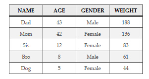

第五章     行与列
================================
------------------------------------

<center></center>

----------------------------------

###表现数据的最基础和应用最广的方法之一就是使用行与列，每一行是一个案例或是实例，每一列是一个变量或是属性。尽管电子表格并不常常提到案例或变量的概念，但是大部分电子表格依然用行与列的形式来组织数据。R语言中行与列的的形式可以通过数据框这种对象来表现出来。

我们生活在一个三维的世界中，在这个世界里，麦片盒有着高度，宽度，深度。然而一个可悲的事实是，现实生活中也存在着诸如纸张，黑板，白色写字板和电脑屏幕这些只有二维的物体。其结果是，大部分统计学家，会计，计算机科学家和与大量数据打交道的工程师倾向于用行与列的形式来组织数据。

这种形式除了使得用数字填写一张矩形纸片的过程变得容易之外，再无更好的使用理由。行与列可以通过你想要的任意方式来组织数据。但是最常见的方式是，行表示案例或实例，列则表示属性或是变量。我们来看下这种的行与列的二维呈现形式。

<center></center>

一目了然，对吧？最上面粗体字那行并不是数据的一部分，它包含了属性或变量的名称。注意，计算机科学家喜欢叫它们为属性，而统计学家则喜欢叫它们为变量，这两种术语都行。比如说，年龄是每个活物都具有的一个属性，你可以用分，时，日，月，年，或者其它的时间计量单位来度量它。在上表中，我们用年来度量年龄这个属性。从技术上讲，在顶行的变量名称是元数据，或者你也可以把它当作数据的数据。试想一下，如果没有元数据，凭空去理解上面这张表中的数据是很难的。元数据有很多种不同的类型，变量名称只是元数据类型中的一种简单形式而已。

如果你无视包含有变量名称的顶行，那么剩下的每一行则是一个案例或实例。再次提醒一下，计算机学家可能会称它为实例，统计学家则可能会称它为案例，但是两种术语都行。重要的是，每一行对应着一个实际事物。在这个例子中，我们的所有的事物都是来自于同一个家庭的生物。你可以把NAME列看成一个案例标签列，每个标签对应着且只对应着我们数据中的唯一一行。当你在处理大型数据集的时候，大部分情况下，案例标签都是数字，每个案例的数字都是独一无二的（换句话说，相同的数字不会在两行或者两行以上中出现）。计算机学家有时把这列独一无二的数字称为键，键是一个很有用的东西，尤其是在从不同的数据源中匹配事物时，我们稍后再讨论这个问题。现在，只要关注这个信息，即虽然他们都是男性,但"Dad"行明显不同于"BRO"行。即使我们再加一个"Uncle"行，与"Dad"有着相同的年龄，性别，体重，我们仍然能够能把这两行分开，因为一行有着"Dad"的名称，而另一行的名称则为"Uncle"。

另一个重要的提示：每一列都包含着相同类型的数据。举例来说，年龄这列都是数字。这列中并没有诸如“老”或者“年轻”这样的词汇。这是一种使事物有组织的一种真正有价值的方式。毕竟，如果这列有一些诸如老或年轻之类的小段文本的话，我们在年龄这列不能运行mean()这个函数。作一个相关的提醒，每个元胞（行与列的交集处，举例说，姐姐的年龄）包含着一条信息。尽管电子表或者字处理程序可能允许我们将两个或两个以上事物放到元胞中，但实数处理程序却不会允许我们这样的行为。最后，我们可以看到每列有着相同的数字输入，以致于整体形成了一个漂亮的矩形。统计学家和处理大型数据库的那些人在处理数据集的时候，他们期望能见到这种矩形的组织结构。

现在我们来看下，怎样把数据以行与列的形式输入R中。你在R中很快就可以学到的一件事是，实现一个目标往往有多种方法。有时，最快或者最有效的方法并不是最容易理解的方法。在此例中，我们将逐列建立每列，然后将它们合并于一个数据框中。这种方法有一些费工费力，同时并不是我们处理一个数据集的常规方法，然而，这种方法易于理解。首先，我们运行下列命令来创建列的名称:

```{r}

myFamilyNames <- c("Dad","Mom","Sis","Bro","Dog")

```

你可能要注意的一件事是每个名字都被放到双引号之中。这个双引号的意思是你给了R一个信号，表示你想要把双引号中的内容看作一个字符串，而非存储地点的名字。如果我们要求R使用Dad而非“Dad",它将会寻找一个叫Dad的存储位置（即一个数据对象）。需要注意的另一件事情是双引号之外不同的值之间用逗号分隔开。如果你写了一个普通的句子，那么这件事无关紧要，但是对于计算机编程来说，逗号只有不在引号之间的时候，它才能分开不同的值。一旦你键入上面那行代码，随后要记得输入下面这行命令来检查myFamilyNames的内容

	> myFamilyNames
  
输出应如下：
```{r echoExample,eval=TRUE,echo=FALSE}
  myFamilyNames

````
下一步，你可以建立一个关于家庭成员年龄的向量，就像这样：
```{r}
myFamilyAges <- c(43, 42, 12, 8, 5)
```
注意，这个命令同我们先前几章用到的命令是完全相同的。如果你一直在运行R的话，那么你现在无需再次输入这行命令。因为myFamilyAges一直都在。实际上，如果你关闭了R，当处理完先前几章的例子后，你关闭了R， 系统提示“保存工作区”。如果你这样做了，R会存储所有的你在先前几节使用的数据对象。你可以在一个空白的命令行上输入myFamilyAges来检查。输出应如下：
```{r}
  myFamilyAges
````
	
嘿，现在你已经使用c()函数和赋值箭头来为myFamilyNames和
myFamilyAges来赋值。如果你在这章的先前部分看到这张数据表。你应该能够想出创建myFamilyGenders和myFamilyWeights的命令语句。如果你遇到了困难，那么你也可以在下一页中找到相应的答案。但是你在翻到下一页之前，还是应该努力找出答案。在你键入命令来建立新的数据对象之后的每一个案例，你也应该在命令行中键入数据对象的名称以确保它看起来像那么回事。对于变量，每一个变量有五个值。两个变量是字符型数据，另两个变量则是整数型数据。以防你需要它们，下面给出这两个额外的命令语句：
```{r}
myFamilyGenders <- c("Male","Female","Female","Male","Female")

myFamilyWeights <- c(188,136,83,61,44)
```

现在，我们来介绍一下数据框。在R中，数据框是一个列表(关于列的），列表中的每个元素都是一个向量。每个向量都具有相同的长度，这样我们才能让我们的漂亮矩形的行和列建立起来。一般每个向量也有它自己的名称。建立一个数据框的命令很简单：
```{r}
myFamily <- data.frame(myFamilyNames, + 
myFamilyAges, myFamilyGenders, myFamilyWeights)
```
注意哦，上面这个命令有点略长，所以我们不得不把它断成两行
。第一行行尾的加号告诉R在处理命令前要等下一行的输入。当然了，如果你想的话，你可以把所有的命令都塞到一行中，但是这样做的话呢，就得把“+”去掉。无论如何，data.frame()函数可以把我们先前输入的四个向量变成一个数据框。当然我们也可以使用赋值箭头来生成一个新的储存位置来放入数据框。这种新的数据对象就是我们所说的数据框，它的名称叫做myFamily。一旦你输入了上述命令，可以在命令行中输入myFamily来得到一个数据框内容的回馈。你看到的输出应如下：
```{r}
myFamily
```

看起来不错哈。注意哦，R把行数（也就是那1，2，3，4，5）放在了我们数据每一行的前面。这不同于我们先前在[]括号中看到的数字，因为这些数字是数据框中的实际“索引”。换句话来说，这些行号是R用来追踪某一特定的数据在哪一行。

像这样的小型数据集，只有五行，对所有的数据进行一览也很简单。但是当我们处理一个大型数据集的时候，这种方法也不实际。我们需要其他的方法来总结这些数据集。第一种方法是用来来显示结构的类型，结构就是是R用来存储数据对象的
```{r}
str(myFamily)
```

在此献上首次提醒，这个例子表明，命令提示">"是用来区分命令与其后的输出结果的。你无需键入这个符号，当R准备接受新的输入时，它会自动产生这个符号。这本书从现在开始的例子中，R命令将与输出结果混合在一起，所以哦，要时刻注意">"这个符号，因为在这个符号之后的命令才是你所要键入的。


