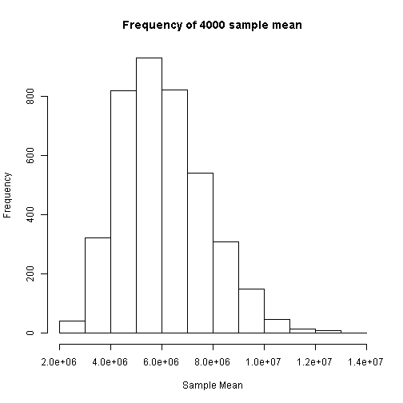

第七章：罐子中的样本
==========

----
<center>

</center>
----

抽样分布是理解统计推断的关键概念。为了理解随机性在抽样时所产生的影响，很多讲解抽样分布的方法都提到了从罐子中抽取弹球或糖果这样的经典例子。通过前面提到的美国人口的例子，我们可以清楚的看到尽管总体的分布不是正态的，但其样本均值的分布却服从正态分布。

想象你拥有一个装满了红色和蓝色糖果的罐子。罐子中放入的红色糖果和蓝色糖果各有100颗，但这些糖果在放入罐中时是混合在一起的。如果你从罐中随机抽取8颗糖果，你会得到什么颜色的糖果？如果抽取如想象中般顺利的话（虽然通常都没那么走运），你将会抽到4颗红糖果和4颗蓝糖果。红的和蓝的各占一半，这个比例和罐中的红蓝比例是一样的。当然了，你很难抽到这个结果，是不？除了4红4蓝的组合，你也可能会抽到3颗红糖果和5颗蓝糖果，或者其他各种你能想到的组合。事实上，尽管概率很小，但你还是有可能抽中8颗红色的。虽然有多种可能，但仅就一次抽取结果来看，我们是无法预测会抽到红和蓝的哪种组合的。而这种不确定性，就是能够以无法预知的方式来影响你抽取结果的随机性的力量。

我们现在提出一个有趣的想法，这虽然对预测单次抽取结果没什么帮助，但却能很好的展示多次抽取的*长期趋势*。从罐子中抽取8颗糖果，数一数其中有多少红色的，然后将所有的糖果都放回罐中。我们并不需要数蓝色糖果的数量，这是因为 `8 - 红色糖果的数量 = 蓝色糖果的数量`。将罐中的糖果晃动一下，这样能混合的更好一些，然后再抽取8颗糖果，同时数一下红色糖果的数量。将这种操作重复多次，我们可以对每次记录的结果用下面的表格来表示：
<center>
<table>
   <tr>
      <td>抽取次数</td>
      <td>红色糖果的数量</td>
   </tr>
   <tr>
      <td><center>1</td>
      <td><center>5</td>

   </tr>
   <tr>
      <td><center>2</td>
      <td><center>3</td>
   </tr>
   <tr>
      <td><center>3</td>
      <td><center>6</td>
   </tr>
   <tr>
      <td><center>4</td>
      <td><center>2</td>
   </tr>
</table>
</center>

注意到表格左边的列就是对抽取次数的计数而已。表格右边的列是我们感兴趣的内容，它列出了每次抽样中的红色糖果数量。在本例中，红色糖果的数量真是天南海北。在第4次抽样时，我们只抽到了两颗红色糖果，但是在第3次抽样时，我们却抽到了足足6颗红色糖果。但是本例最有趣的地方就是，如果你将这4次抽取的红色糖果数量进行*算术平均*，你会得到平均每次抽到*正好4颗红色糖果*的结果，而这正是我们期望的红蓝各半的罐子中应该抽出的结果。以上只是一个人为制造的例子，而我们在平时抽取时，很难在仅仅4次抽取之后就遇到这么好的平均的结果。但是如果你将随机抽取这一操作，进行了4000次，你将会肯定得到一个接近 **平均每次抽到4颗红色糖果** 的完美结果。

从总体中不断的抽取子集的过程称为“抽样”，而经过大量的抽样之后，我们会最终得到抽样分布。注意到，在刚才这句话中，我们用到了“总体”这个词汇，用来代表我们从什么地方做的抽样，这也是它的统计含义。在前面章节的例子中，我们的数据集包含美国各个州的人口数量，这个“人口”与“总体”同样使用英文单次 population 可以说是一个巧合。下面，我们使用 R 来帮助我们从美国各州人口数据集中抽取大量样本。

R 中有一个很便捷的函数 sample()，可以用来从数据集中简便的抽取样本。我们可以用它来从我们的数据集中抽取样本：


```r
set.seed(31415)
sample(USstatePops$V1, size = 16, replace = TRUE)
```

```
##  [1]  1852994  4339367  3574097  2967297  2915918  4533372  1360301
##  [8]  5773552  6724540  6346105  3574097  3751351  1052567 37253956
## [15]   814180  3046355
```


(译者注：原著中并未使用set.seed()来设置随机的种子，这会导致读者的可重复性研究非常困难。在本章中我们统一将种子设置为31415。读者也如此设置，便可实现和我们相同的抽样结果。)在本例中，注意到我们调用的sample()函数含有三个参数。第一个参数是数据源。对于第二个和第三个参数，为了让 R 能够正确识别，我们采用了“命名参数”的方式来调用，而不是单靠这些参数在参数列中的位置。参数 `size = 16` 可以让 R 从总体中抽取16个州的人口作为样本。参数 `replace = TRUE` 则规定了一种统计学家经常用来简化数学证明的抽样方法。对我们来说，采取放回抽样还是不放回抽样通常没有实际的影响，所以我们直接使用统计学家的常用方法。

相较于给抽取的各色糖果计数，我们在处理类似于各州人口的这类数值时，对其算数平均数，或者称为均值，更感兴趣。于是我们可以让 R 使用mean()来计算所抽取的样本均值：


```r
set.seed(31415)
mean(sample(USstatePops$V1, size = 16, replace = TRUE))
```

```
## [1] 5617503
```


从上面的mean()函数可以看出，我们又遇到了函数的嵌套调用了。我们在mean()函数的输出中并未看到从51个州中随机抽取的16个州人口数值，而是看到了mean()函数直接用这16个数来为我们计算出来的均值。如果你的记忆力很好，或者往前面的章节翻一下，你会看到51个数值的均值是 6053834. 于是你会发现我们从这16个州
的样本获得的均值真的是离总体的均值相差的有点远。我们是不是应该感到焦虑？当然不是！我们知道，当抽取样本时，无论是抽取糖果，还是抽取各个州，我们的样本均值永远都不会和总体均值正好一样。其实我们并非对某一次抽样的结果感兴趣，而是要专注于长期抽样的结果。于是，我们现在要让 R 来帮我们做重复抽样了，不是抽取1次、4次，而是400次甚至4000次。和其他的编程语言一样，R 有很多方法可以重复某个操作。其中最简单的一个方法非replicate()函数莫属。让我们先尝试一下重复4次：


```r
set.seed(31415)
replicate(4, mean(sample(USstatePops$V1, size = 16, replace = TRUE)), simplify = TRUE)
```

```
## [1] 5617503 3945129 6510150 4407374
```


简单的不可思议吧！我们仍然使用了刚才用过的命令，即用来计算16个州的均值的mean()函数。只不过这一次，我们将mean()函数作为一个参数放到replicate()函数里面，于是我们才可以一次又一次的求均值。其中的 `simplify = TRUE` 参数是让 R 将函数运行的结果以一个均值构成的向量形式返回，而这正是我们想要的形式。由于我们只将mean()函数运行了4次，所以我们不会看到满屏的数字。从刚才的尝试来看，我们可以很轻易地将求均值的过程重复400次。你可以自己试一下，看看结果。至于在本书中，我们要将replicate()函数整个塞进另一个mean()函数，于是我们可以得到400个样本均值的平均数。我们来看一下：


```r
set.seed(31415)
mean(replicate(400, mean(sample(USstatePops$V1, size = 16, replace = TRUE)), 
    simplify = TRUE))
```

```
## [1] 5983180
```


在上述命令中，最外层的mean()函数地位与之前命令的不同。将这个多层嵌套的命令的效果，用语言来描述一下就是：a)从51个州的总体中抽取400个样本容量为16的样本; b)对每一个样本计算其样本均值，并将均值保存到一个列表中; c)当计算完这400个均值后，计算包含有400个均值的列表的均值。从刚才的计算结果可以看到400个样本的均值是5983180. 虽然这个值和总体均值仍然不相等，但是已经接近了。我们距离总体均值的真值大概70000多，大概是1.16%(更精确的数值为70654/6053834 = 1.167%)。你可能也注意到了，即使你有一个速度较快的电脑，运行刚才的命令也得花一些时间。因为刚才的命令的确包含了很多操作！让我们更进一步，看看我们是否能更加接近总体均值：


```r
set.seed(31415)
mean(replicate(4000, mean(sample(USstatePops$V1, size = 16, replace = TRUE)), 
    simplify = TRUE))
```

```
## [1] 6052941
```


现在我们更加接近真值了！我们得到的均值距离总体均值的真值只差不到千分之一！你可能注意到你在运行上述几个命令时得到的结果与我们有少许不同，这是因为你在运行sample()函数时，随机抽取的400或4000个样本与上述命令得到的不同，但是最终均值结论的精确性却相差不多。(译者注：这是由于原著中没有使用set.seed()来明确生成的随机序列，读者如果按照译文中的命令来执行，是会得到与我们完全相同的结论的。我们也建议读者在任何涉及到随机抽样的模拟中，添加set.seed()，以便将来的可重复性研究。)

我们准备进行下一步了。这次我们不用一个简单的算术平均来概括抽样分布的均值了，我们使用更复杂的直方图来观察抽样分布的均值序列。

这个直方图展示了4000个均值的频数分布。对这张图详细观察可以训练你阅读频数直方图的能力。这个直方图具有典型的近乎于钟形的但仍然有点右偏的形状。最高的，也就是频数最大的区间正好和均值真值6053834不远。

另外，你能否自己找出生成这张直方图的命令？你只需要将前面的命令之中的最外层mean()函数替换为hist()函数即可。在本例中，代码如下：


```r
set.seed(31415)
hist(replicate(4000, mean(sample(USstatePops$V1, size = 16, replace = TRUE)), 
    simplify = TRUE), main = "Frequency of 4000 sample mean", xlab = "Sample Mean")
```

 


这是一个伟大的时刻，请让我们做一下深呼吸。我们刚刚仅用短短几页就概括了统计思想在数百年间的成果。事实上，我们提到的有两个重要思想，“大数定律”和“中心极限定理”。这两个重要理论的确花费了像Gerolamo Cardano(1501-1576)和Jacob Bernoulli(1645-1705)这些数学家们数个世纪才最终得到。如果你去查阅这些理论，你会发现有很多令人迷惑的数学论证细节，但对我们来说，在这之中是两个浅显的道理。首先，如果你运行了同一个统计过程很多次数，则最后通常会收敛到一个稳定的结果。对本例来说，我们知道50个州加上哥伦比亚特区（即华盛顿首府）的平均人口是多少。这51个观测值就是我们的总体，此时我们想知道要像得到这个均值真值的较好的近似，我们需要抽取多少个容量为16的样本。我们了解到只抽取一个样本会得到较差的结果。抽取400个样本能够得到距离真值只差1.16%的较小的误差。而抽取4000个样本得到的均值距离真值的差距都不超过千分之一。如果我们将抽样过程重复40000次乃至400000次，我们会得到和真值6053384极端接近的所有样本的均值。

其次，当我们将大数定律纳入考虑，并将其运用到样本均值时，我们发现样本均值形成的分布开始向钟形或正态分布靠拢，所有样本均值的均值也和总体均值真值越来越近。样本容量越大，则均值接近真值的速度也越快，相反，当样本容量小的时候，你就得抽取非常多的样本来使得样本均值的均值和总体均值足够接近。为了说明这一点，我们举一个有趣的例子，该例中样本容量大于16. 我们抽取的样本容量为 `n = 51`(与总体的单位数量相同)，共重复抽取100次：


```r
set.seed(31415)
mean(replicate(100, mean(sample(USstatePops$V1, size = 51, replace = TRUE)), 
    simplify = TRUE))
```

```
## [1] 6016650
```


现在我们的计算结果与总体均值已经相差不超过1%了。你可能会觉得有点摸不到头脑，“等一等，难道样本容量为51不就是把总体中所有的单位都抽取了吗？”这的确让人迷惑，但这个问题可以追溯到前几页里我们提到的可放回抽样（当时我们在抽样命令里也是使用了 `replace = TRUE` 这个参数）。可放回抽样的意思是随着你从总体中抽取了一个单位来放到你的样本中，紧接着你就把它又放回了总体的单位里去，这也意味着你有潜在的可能性在接下来的抽取过程中再次抽中它。如前文所说，我们已经省略掉了相应的证明部分，而这除了会让你迷惑以外，并不产生任何问题。事实上，我们可以让样本容量更大，而不会带来任何麻烦：


```r
set.seed(31415)
mean(replicate(100, mean(sample(USstatePops$V1, size = 120, replace = TRUE)), 
    simplify = TRUE))
```

```
## [1] 6028504
```


这个命令对容量为 `n = 120` 的样本重复抽取了100次。让我们来看看抽样分布的均值和总体均值有多么的接近了！回顾之前我们提到过的，每次你运行这个程序，你都会得到稍微不同的结果，这是因为每次抽取的都是不同的样本（译者注：如果使用了set.seed()就不会遇到这种情况）。但是按照以往的经验，随着统计学家们用 `n` 来表示的样本容量越来越大，你对总体均值的估计也会越来越接近真值。相应的，如果你抽取更多的样本量，你的估计也是越来越准的。

现在，如果你已经从刚才的状况缓了过来，那么就让我们来进一步的利用抽样分布来做更多的事情吧。首先，让我们将所有样本均值保存下来，以便我们可以对这列数进行下一步的计算：


```r
set.seed(31415)
SampleMeans <- replicate(10000, mean(sample(USstatePops$V1, size = 5, replace = TRUE)), 
    simplify = TRUE)
```


我们是将所有的抽样均值保存到一个称为“SampleMeans”的新向量中。我们应该有10000个样本均值：


```r
length(SampleMeans)
```

```
## [1] 10000
```


这些抽样均值的算术平均数应该和我们的总体均值6053384相当接近：


```r
mean(SampleMeans)
```

```
## [1] 6062372
```


你可能还想要对 SampleMeans 生成一个直方图，来看看频数分布是如何的。目前，我们所需要查看的只是这列抽样均值数列的一个总括：


```r
summary(SampleMeans)
```

```
##     Min.  1st Qu.   Median     Mean  3rd Qu.     Max. 
##   822000  3880000  5380000  6060000  7650000 24500000
```


如果你需要回顾中位数（median）和分位数（quantile）的概念，可以回头看看第3章-行和列。

这个总括里包含了很多信息。首先让我们来看看最大值（max）和最小值（min）。这列样本均值的最小值是822000。让我们思考一下，当我们知道总体均值是那么大的时候，怎么会抽取到均值这么小的样本呢？怀俄明州（Wyoming）在那个样本中一定被抽到过好几次吧！答案和伴随着抽样过程的随机性有关。如果你运行某个随机抽样程序10000次，那么你肯定会遇到几个很怪异的样本的。这很像是买彩票。你买的大多数彩票都是正常的——中不了奖的。但是就在某个时刻，你也会遇到那个极其特殊的大奖。抽样过程和此类似：极端特殊的情况是很不寻常的，但是如果你抽样的次数足够多，你也会遇到这种情况的。对于最大值我们也有类似的结论：我们抽到的最大的样本均值24500000，比总体均值大得多。

SampleMeans的中位数5380000和均值6060000比较接近，但并不完全相同。这是因为我们的样本均值分布有点右偏（数值较大的右侧尾巴比对称情况下要长，这是由于原始分布是反向J形的）。中位数是很有用的，这是因为它把所有的样本等分为两半：50%，或者5000个样本均值是比5380000大的，另外一半是比5380000要小的。因此，如果我们此时要从总体中再随机抽取一个样本的话，那么它就有一半的可能性大于中位数。分位数能够帮助我们更好的对数据进行分割。第三分位数将数据较小的75%和较大的25%分开。因此只有25%的样本均值大于7650000。这意味着如果我们再从总体中随机抽取一个样本的话，那么这个样本均值只有25%的可能性是大于7650000的。类似的，第一分位数告诉我们，如果随机抽取一个新的样本的话，那么样本均值只有25%的可能性是比3880000要小的。

有另外一种更加灵活的从R中获取相同信息的方法. quantile()函数可以展示中位数以及分位数, 例如


```r
quantile(SampleMeans, probs = c(0.25, 0.5, 0.75))
```

```
##     25%     50%     75% 
## 3875658 5379840 7649252
```


你会注意到这些数值与上文summary()函数展示的数值的少了千分之一(one tenth of one percent). quantile()函数的结果比较精准, 尽管summary()函数的结果可以满足绝大多数的需求. 使用quantile()函数的另一个原因是我们可以精准的控制分割点. 为了得到分位数, 我们在25%, 50%, 75%进行分割. 但是如果我们希望在2.5%和97.5%进行分割该怎么办? 这对于quantile()函数来说很容易:


```r
quantile(SampleMeans, probs = c(0.025, 0.975))
```

```
##     2.5%    97.5% 
##  2019463 13318627
```


在这个例子里, 如果我们选取新的样本, 样本均值仅有2.5%的几率低于2019463. 类似的, 样本均值仅有2.5%的可能性会大于13318627(因为有97.5%的数值低于样本均值的分布).

我们来做个练习. 这里的人在一定区域内，其中每一个领域是某种与美国相关联的单元的数目的样本

3,706,690
159,358
106,405
55,519
53,883

我们可以很容易的在R中计算样本均值


```r
MysterySample <- c(3706690, 159358, 106405, 55519, 53883)
mean(MysterySample)
```

```
## [1] 816371
```


我们的神秘样本的均值是 816371. 但问题是, 这是一个美国各州的样本还是其他? 仅有这一个样本很难回答这个问题. 我们首先会观察到样本中含有比Kansas, Utah, Nebraska 和其他几个州都要多的人数. 从上文的人口数据的分布我们也可以看出很多州的人数都很小. 多亏了我们在上文中举的例子使得我们可以更好的进行比较. 我们有样本均值的分布并且我们可以很公平的拿新的样本均值与之对比, 新的均值超出了样本分布的极限区域, 也就是低于2.5%或高于97.5%. 故我们的神秘样本看起来不像是美国各州的取样.

既然这样, 我们可以清楚的看到816371处在样本分布的极低区域. 回想我们使用quantile()函数时我们发现仅2.5%的样本均值低于2019463.

事实上, 我们可以使用更为严格的标准:


```r
quantile(SampleMeans, probs = c(0.005, 0.995))
```

```
##     0.5%    99.5% 
##  1414671 17084662
```


quantile()函数显示仅有0.5%的样本均值低于1414671. 因此我们的神秘样本的均值816371如果是美国各州的采样, 那么必然是个小概率事件. 从这一点我们可以基于有力的统计证据来暂时推测, 我们的神秘样本**不是**美国各州的采样. 神秘样本的均值比美国各州样本的均值小太多.

事实上我们的推测是正确的: 神秘样本包含五个不同的美国领土, 其中包含在太平洋加勒比海地区的Puerto Rico. 那些领土是由一些大陆块和与美国有关系的一群人组成, 但是他们与美国各州不同. 也就是说他们都是岛屿, 因此他们的人口数都限制在大陆块中. 尽管在美国各州中仅夏威夷是岛屿, 但事实上夏威夷岛是美国大陆上各州面积的10倍以上. 这个例子中我们最值得学习的就是这组数据的属性, 尤其是与已知样本均值的分布不同的均值, 可以让我们推断出这组数据并非从原始数据中采样.

这是所有统计推断的基础. 你构建一个比较分布并且划分出一些极限值所在的区域,然后你用新获取到的数据与已知分布进行比较看新样本是否会落入极限区域. 如果新样本符合上述规律, 那么你可以暂时认为新样本是从其他数据源获取到的.

如果你有一些困惑，那么不要气馁. 上一段话代表了四五百年的数学发展. 在没有像R这样的可以创造和分析真实样本分布的工具之前, 上述的绝大多数材料仅是一系列的公式和证明. 在后续的章节里我们会回到用户证明上述描述的特定统计规程. 但是现在我们仅需要记下其他三条信息.

第一, 我们使用mean()函数查看样本均值的分布和使用hist()函数查看它的形状, 但是我们从不量化分布的离散程度.


```r
sd(SampleMeans)
```

```
## [1] 3016920
```


这里显示样本分布的标准差. 统计学家称之为"均值的标准误差". 这个拗口的术语有另外一个清晰但较长的解释: 人口采样的样本分布均值的标准偏差. 不幸的是, 统计学家并非全都知道. 当我们看一个分布并且分布中的每个点都代表一个样本(例如, 一个均值), 那么标准差就可以认为是标准误差.

第二, 发现标准误差其实不需要构造一个10000个（或其他任意个数的）样本均值构成的经验分布. 事实上, 原始数据的标准差和标准误差具有一定的关系:


```r
sd(USstatePops$V1)/sqrt(5)
```

```
## [1] 3051779
```


上述公式表示用原始数据的标准差除以样本大小的平方根. 在上文中当我们使用replicate()和sample()命令创建SampleMeans向量时, 我们使用的样本大小n=5. 这就是为什么你在上文中看到sqrt(5)的原因. 在R或者其他软件中sqrt()是"square root"的简写, 而不是你预期的"squirt". 因此如果你有一系列数据并且你想计算他们的标准差,  你可以计算样本均值分布的标准误差(每一个都有相同的样本大小), 除以样本大小的平方根. 你可能发现通过使用这种方法得出的结果会比直接从样本分布中得到的结果大一些, 但是这种差异没有任何意义(仅是因为分布的随机性导致). 另一个你会注意到的事情是样本空间越大, 标准差越小. 这对于样本的选择有很重要的法则: 样本越大越好.

最后是另外一个简便方法. 我们创建样本分布的97.5%的分割点并且使用quantile()函数计算真实的分割. 我们同样可以使用均值和标准差计算分割点. 均值减去2倍标准差就是2.5%的分割点, 均值加上2倍标准差就是97.5%的分割点.


```r
StdError <- sd(USstatePops$V1)/sqrt(5)
CutPoint975 <- mean(USstatePops$V1) + (2 * StdError)
CutPoint975
```

```
## [1] 12157391
```


你会发现这个数值与我们使用quantile()函数计算全部分布的数值有差别. 这种差异由我们构建的分布的随机性导致. 上述结果仅是基于统计证明的估计值, 而我们创建的SampleMeans 数据集仅是我们能创建的最大的接近无限的集合. 我们可以很容易的通过使用更大的样本容量和添加更多的抽样分布的抽取次数来降低两种方法之间的矛盾.


总结一下, 我们使用了一个有51个美国各州人口数据的数据点和一些R的知识创建了一个样本均值分布, 我们学到了以下知识:
- 持续运行一个统计过程多次你就可以得到一致的规律.
- 计算大样本的均值和绘制直方图可以展示样本均值是正态分布并且分布中心与原始数据的均值接近.
- 样本均值形成的分布可以用来进行比较. 通过在极低的区域和极高的区域使用分割点, 例如2.5%和97.5%, 我们可以把它与新获取的样本进行比较.
- 如果我们获得新的样本均值, 并且我们发现它掉入我们设定的极限区域, 我们可以暂时认为新样本与之前的数据来自不同数据源.
- 另外一种更精确的计算标准差的方法是使用原始数据的标准误差.


目前为止我们仍不是统计学家, 但是建立在样本分布上的推理过程是统计推理的核心. 假如你理解了本章的内容, 你已经向成为一个应用统计人才的道路迈出了坚实的一步. 


本章测试
收集一个包含至少20个数据点的样本并且构造样本分布. 计算标准差和并且使用标准误差计算2.5%和97.5%的分布分割点. 你收集的数据点必须代表相同数量的现象. 例如, 你可以手机20本教科书的价格, 或者统计20段文字中的单词数量.


资源  
- [中心极限定理](http://en.wikipedia.org/wiki/Central_limit_theorem)  
- [Gerolamo Cardano](http://en.wikipedia.org/wiki/Gerolamo_Cardano)  
- [Jacob Bernoulli](http://en.wikipedia.org/wiki/Jacob_Bernoulli)  
- [大数定理](http://en.wikipedia.org/wiki/Law_of_large_numbers)  
- [美国各州及领土人口](http://en.wikipedia.org/wiki/List_of_U.S._states_and_territories_by_population)  
- [中心极限定理](http://www.khanacademy.org/math/statistics/v/central-limit-theorem)  


本章使用的R命令  
- length(). 获得向量中的元素数量.  
- mean(). 算术平均值或者一系列值的均值  
- quantile(). 基于百分比或比例计算分割点.  
- replicate(). 多次运行一条语句/计算.  
- sample(). 在向量中随机抽取元素.  
- sd(). 计算标准差.  
- sqrt(). 计算平方根.  
- summary(). 返回向量的描述性信息.   


