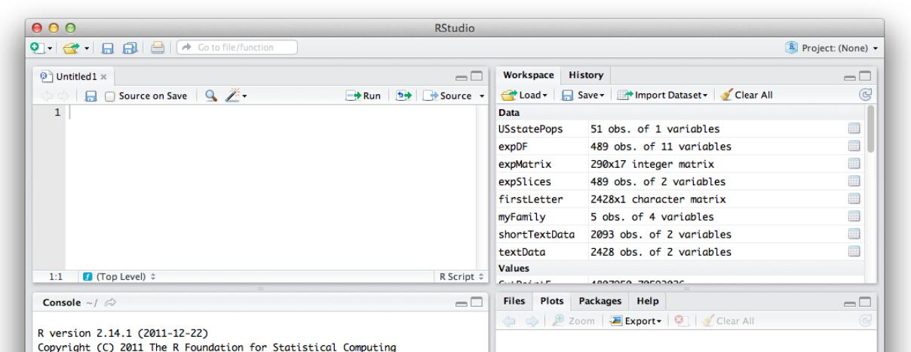
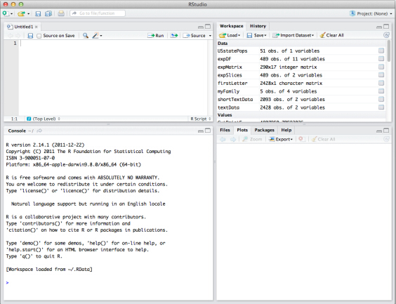
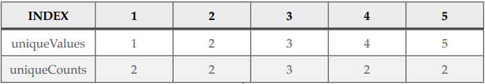

**作为一个拥有活跃的用户社区的开源软件，R之所以能不断创新发展离不开社区志愿者无私贡献。其中一个非常重要的创新就能完美支持R语言副本的R-Studio框架。本章从R-Studio的安装开始，然后再详细介绍了“包”――扩展R的关键。**

Joseph J. Allaire 作为一个连续创业家和软件工程师，开发了一系列著名软件，包括ColdFusion和微软博客工具Windows Live Writer，其中ColdFusion后来被卖给了网络媒体工具巨头Macromedia。从2009年开始，Allaire和一个小团队开始开发一款开源软件，用来提高R的可用性和效率。

如同前面章节所述，作为一门开源语言，R可以创建Mac，Windows，或者Linux平台下的副本，并且允许所有人检查和修改。同其它开源项目一样，社区里有大量活跃的志愿者致力于R语言的改善，包括语言本身，以及为R添加新的内容。其中一个新添加的内容就是R-Studio。R-Studio是一种集成开发环境（IDE，Integrated Development Environment）。每一个软件工程师都知道IDE在软件开发过程中的重要性。你可以把R想象成地板上卷起的一块帆布，而R-Studio则像一个优美的相框。当你把R放在R-Studio中后，就像任何好的相框一样，R-Studio能让R显得更加优美，具有鉴赏性。

你可以在任何时候登陆R-Studio官网 <http://www.rstudio.org> 来查看有关信息。在本章剩下的部分中，你需要一台装有Mac、或Windows、或Linux系统的电脑来跟着学习R-Studio的安装和使用。

在开始学习R-Studio之前，我们先来了解为什么我们在使用R的时候需要一个IDE。在前面的章节中，我们都是通过总所周知的“R控制台”来输入各种各样的R命令。控制台是一个非常古老的技术术语，可以追溯到电脑大得还需要单独的空调室的时代。当时控制台作为“主控台”，接受各种操作命令，完成对整个巨大的计算机的控制。如今，控制台这个术语在很多场合都是指可以直接输入命令的界面。我们之前学习R语言以及一些数据结构和统计学基本原理的时候，就是通过在R控制台中输入命令来完成的。

而要想真正搞数据科学，我们也不可能整天坐在电脑面前敲命令。首先，这样很快就会变得非常枯燥乏味。其次，如果老板发现我们在重复输入昨天输过的命令，他就会开始怀疑我们的工作。最后，也是非常重要的一点，如果实现所有的小任务必须通过手动输入一些命令来完成的话，这会非常容易出错，产生计算机科学家所谓的“bug”。考虑到这些原因，我们这本书的一个目标就是要创造一些可以重复使用的东西，这样我们就可以简单点几下鼠标或是输入一些简单的东西就可以完成需要很多处理步骤的任务。使用IDE，我们就可以轻松建立这样的可以重复使用的部分。IDE整合了各个功能，用的时候打开对应部分，不用的时候将其隐藏或者关闭即可。由于我们和数据打交道，我们需要非常细致的检测这些数据，包括数据内容及其结构。你可能也已经注意到了，通过R控制台来完成这些内容非常无聊的，其输出的一大段的文字并且有的文字在你看清之前就被挤出了屏幕。作为R语言的IDE，R-Studio就允许我们控制和监视代码和文字，这样在某种程度上可以支持我们创造可重复使用的内容。

在做这些之前，首先必须在电脑上安装R-Studio。安装R-Studio之前，必须先安装R。如果你已经在第二章中完成了R的安装，剩下的R-Studio的安装就是小菜一碟。在安装R-Studio之前，你必须确保安装的R是最新的版本。R-Studio官网 <http://www.rstudio.org/> 上有丰富的文档，只要跟着这些文档的说明来安装，问题应该不大。如果安装过程中要求你选择安装“R-Studio服务器版”还是“桌面应用版”，选择后者即可。稍后我们会对R-Studio服务器版本进行介绍，但是现在选择桌面版本即可。如果你还想了解额外的关于R-Studio的信息，可以参考John Verzani（2011，Sebastopol，CA：O'Reilly Media)写的书：*Getting Started with R-studio。*该书第一章就对R和R-Studio进行了大体介绍，也介绍了如何安装和更新R-studio。YouTube的一段视频 <http://www.youtube.com/watch?v=7sAmqkZ3Be8> 也对R-Studio进行了详细介绍。需要注意的是，YouTube上有一个磁盘恢复程序和一个音乐组织也都叫R-Studio，因此如果你仅仅用“R-Studio”搜索而不加其他关键词的话，你将会搜到大量和这两者有关的视频。

安装好R-Studio后，你就可以直接运行它来进行本章后面的内容。本书不会像其他学习材料一样把R-Studio界面上的每个部分都介绍一遍，而是在使用到一个特性的时候就将其突出显示出来。当你运行R-Studio时，你将会看到三到四个子窗口。点击“File”菜单下的“New”项，并在“New”的子菜单中选择“R Script”，这样你就能看到类似如下的界面：



```{r}
MyMode <- function(myVector)
{
  return(myVector)
}
```

恭喜你刚刚用R写了第一个函数。一个函数是一组可以重复使用的R代码，每次使用时就不必重新输入相同的代码，其它编程语言里也都有函数这个概念。函数也有“过程”和“子程序”的意思，这在不同编程语言里有轻微的不同。我们给刚定义的函数命名为“MyMode”。从前面多个章节可以看出，除了基本的函数mean()和median（），R的基本安装里面并没有统计学模块的函数。这需要我们自己创建统计模块函数来解决这个问题。回想那个统计一个列表里每个值出现的次数并返回出现次数最多的值的函数，那就是一个统计模块的定义：列表中出现频率最高的项。

关于函数，有几点需要注意。首先、第一行中圆括号括起来的（myVector）表示函数的“参数”，或者说输入。之前当我们调用类似mean（）和median（）等函数时就遇到过“参数”这个概念。其次、注意第二行和最后一行的大括号，在函数中，这些大括号都是成对出现的。最后、注意函数接近末尾的return（）语句，这是将函数完成结果返回的地方。一会当我们在R控制台中调用这个函数时就能看到，返回结果就是return（）语句中括号里的东西。

基于这些说明，你现在知道前面的这个MyMode（）函数做了什么了吗？这个函数其实对我们传入的参数myVector未做任何改动。顺便说一下，写代码时一种常用的方式就是这么一点一点的实现代码。这样我们可以测试每一步都能得到什么样的结果。我们现在就可以测试一下目前的函数能干什么。首先，我们创建一个小的向量。在R-studio的左下角可以看到一个常规的R控制台正在运行。像前面几章一样，在里面输入R命令：
```{r}
tinyData <- c(1,2,1,2,3,3,3,4,5,4,5)
tinyData
```
然后我们就可以试试我们写的MyMode（）函数：

\> MyMode(tinyData)

   Error: could not find function "MyMode"

哦，出错了！R还不知道我们的新函数呢。我们虽然在代码窗口输入了MyMode（）函数，但是还没有告诉R呢。查看左上角的窗口，你可以看到MyMode（）函数的代码，以及在代码上方的工具栏中有一些小的按钮，其中有一个旁边写着“Run”的向右的箭头。选中MyMode()函数的所有代码（从字面“M”到最后的大括号），然后点击Run按钮，你就会立即看到下方的R控制台中出现了相同的代码。如果所有的代码都是正确的，控制台就不会报错或者警告。点击Run按钮后，R编译器就知道了MyMode（）函数，并且准备使用了。再在控制台中输入：
```{r}
MyMode(tinyData)
```
程序将返回我们所期望的tinyData的内容。这个例子中，tinyData就是函数的输入参数，从这个例子我们就可以看出函数的参数是如何工作的。当函数运行时，其将tinyData的内容复制到myVector中，以方便函数中使用。现在，我们在函数中新添加一条语句：
```{r}
MyMode <- function(myVector)
{
  uniqueValues <- unique(myVector)
  return(uniqueValues)
}
```
我们将原来的MyMode函数进行了轻微的改动，结果如上所述。我们只在原函数中加了一行代码，避免函数变得过于复杂。我们先来看看这段代码都干些什么。首先不要忘了选中代码然后点击“Run”按钮，然后在R控制台中再次输入MyMode（）命令：
```{r}
MyMode(tinyData)
```
代码的作用非常明显，我们调用了unique()函数，其返回在tinyData中出现的数值的列表，这个列表中每个数值只出现一次。简单的说，unique()函数就是将输入向量中多余的数值去掉。接下来我们让代码更复杂一点：
```{r}
MyMode <- function(myVector)
{
  uniqueValues <- unique(myVector)
  uniqueCounts <- tabulate(myVector)
  return(uniqueCounts)
}
```
仍然别忘了在使用这个函数前要选中代码然后点击“Run”。这次我们将tinyData作为输入参数传给函数，得到的返回值也是一个有5个元素的列表，但是列表的元素表示的是输入参数中每个数值出现的次数：
```{r}
MyMode(tinyData)
```
现在差不多该结束我们的MyMode()函数了，但是我们得确保理解了uniqueValues和uniqueCounts中的内容：

下面的表中列出了uniqueValues中的元素以及其对应的个数。



首行显示“index”的标号行仅仅是出于说明的目的。这些索引数字用来定位列表中对应的元素的。比如，uniqueValues列表中下标为4的位置值为4，其对应的uniqueCounts的值为2。这样一来，如果我们要寻找出现次数最多的数字，我们只需在最后一行中找到最大的数的下标，然后在uniqueValues列表中找到该下标对应的值即可。在R语言中，我们只需一行代码就可以实现前面描述的过程：

> uniqueValues[which.max(uniqueCounts)]

其中，whicn.max()函数用来找到uniqueCounts中最大数在数组中的下标，然后在uniqueValues中通过一对方括号就能访问方括号中下标对应的元素。例如uniqueValues[5]就能得到uniqueValues中的第5个数。我们把这条语句加到return语句中，来完成我们的函数：
```{r}
MyMode <- function(myVector)
{
  uniqueValues <- unique(myVector)
  uniqueCounts <- tabulate(myVector)
  return(uniqueValues[which.max(uniqueCounts)])
}
```
现在我们准备再次测试这个函数，注意不要忘了选中所有代码然后运行一下，否则编译器记住的只是旧的那个函数。我们先回忆一下tinyData中都有些什么元素，然后再把tinyData作为参赛传给函数：
```{r}
tinyData
MyMode(tinyData)
```
可以看出，函数工作正常。tinyData数组中出现最多的数是3。我们继续测试看看函数还会发生什么：
```{r}
tinyData <- c(tinyData,5,5,5)
tinyData
MyMode(tinyData)
```
我们向tinyData数组末尾中添加了三个5，现在tinyData中有五个5，MyMode()函数也执行成功。我们在继续测试：
```{r}
tinyData <- c(tinyData,1,1,1)
tinyData
MyMode(tinyData)
```
你会发现这很奇怪，现在tinyData中明明是1和5都有五个，但是函数返回的的确是1。其实你完全不必惊讶，which.max()函数的说明文档里已经写清楚了，这个函数会返回其找到的第一个最大值。所以出现上面的结果是情理之中的事。事实上，这也总是统计学中常见的一个问题：数据集中不止一个模式。我们的MyMode()函数还无法实现这样的功能，也不能给出任何警告说明数据中出现次数最多的数不止一个，而只是简单的返回其中找到的第一个。
这函数中还有另一个问题：
```{r}
tinyData <- c(tinyData,9,9,9,9,9,9,9)
MyMode(tinyData)
tabulate(tinyData)
```
第一行代码中，我们在tinyData后面加了一连串“9”，注意tinyData中没有6,7,8。而我们运行MyMode()却返回“NA”，这在R中表示某处出错了，你得到了一个空的值。如果我们不输入最后的“tabulate(tinyData)”语句，很难看出程序为什么会出现这么怪异的行为。


