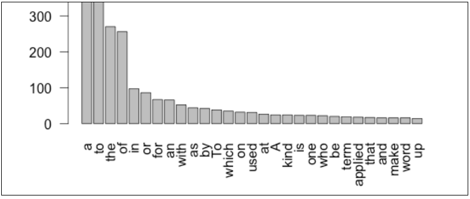

# 数据科学：多面技能

**本节主要内容**

1. 数据科学需要很多其它工作都需要的一个重要技能-数据分析能力，但是这不是唯一需要的技能
2. 通过超市自动收款系统（POS）案例来展示数据科学的各种挑战
3. 数据科学家在数据架构，数据获取，数据分析，数据归档这四个与数据科学相关的设计与实施领域扮演积极角色
4. 案例中突出强调了沟通技能，数据分析技能，伦理推理技能

有人可能一提到“数据科学”这个词就会在脑海里浮现出统计学家穿着白色的实验服眼睛盯着闪烁的计算机屏幕输入一行行的数据的图片。真相远非如此，首先统计学家不是穿着白色的实验服，这一“时髦”是给生物学家，医生以及其他需要保证在充满非普通液体环境中保持服装干净的人预留的。其次，这个世界上大多数数据是非数字化，非结构化的。这里非结构化是说数据不是以整齐的行列存在的。想象一下网页中的各种图片，朋友间的短消息，这当中很少有数字。尽管公司，学校，政府使用比如产品销售，成绩平均绩点（GPA），税收评估等大量数字信息是事实，，不过在这个世界上还有大量的其他信息数学家和统计学家需要观测和处理。因此尽管优秀的数学知识很有用，但数据科学的世界中还有更多我们已经习惯了的字词，列表，图像声音等其它信息也需要处理。

此外数据科学不只是简单的分析数据。许多人喜欢分析数据，他们可以一整天查看直方图与均值，而另一些人则更喜欢其它的工作。数据科学需要各种角色，多面技能。下面让我们以购买一盒麦片中涉及到的数据为例来分析。

不管你喜欢的麦片是水果型，巧克力型，纤维或者是坚果类，首先你会在购物清单里面加入“麦片”这一项。尽管它只是你用铅笔潦草写在信封背面，此时这一计划的购物已经是一份数据，当你到达杂货店，数据会提醒你从货架上取下一大盒水果味麦片放到购物篮里面。在收银台，收银员会扫描盒子上的条码，收款机会记录下价格。而库房里面，计算机会告诉存货管理人员因为你买的是商店里面最后一盒麦片了，所以商店需要向经销商下一个新订单了。同时由于你有一张针对你买的麦片的优惠卷，收银员需要扫描它，给你一个之前预设的折扣。在周末，一份所有来自该麦片制造商的优惠卷信息报表会传给麦片公司，以便他们向杂货店偿付他们向顾客所发的优惠卷折扣。最后，月末的时候，商场经理会看到一组五颜六色的饼图，上面展示了各种不同麦片的销售信息，由于水果类麦片销量强劲，经理决定在商场的有限货架空间中摆放更多的不同种类水果麦片。

小小的一点信息从你在购物清单上潦草涂写开始，在不同地方结束，最重要是它来到经理的桌上帮助决策。在从你的笔尖到经理的桌上的旅程中，数据经历了各种转化。除了计算机会终结或者存储数据以便长期使用外，大量如条码扫描仪之类的其它硬件也会涉及数据的收集，处理，转换和存储。此外，各种不同软件也被用于组织，汇总数据，将数据进行可视化与展示。最后各种“人类系统”也会与数据工作相关。有人需要决定购买或者安装什么系统，谁有权访问什么数据，数据完成使命后如何处理。在前面描述的场景成真之前，连锁杂货店的人员与和合作方需要上千次的具体决策与协商。

显然数据科学家不会参与到上面的每一步中，比如数据科学家不会设计与生产计算机，条码扫描仪等。那么数据科学家最重要的角色是什么呢？一般而言，数据科学家最重要的工作是以下关于数据的四个A：数据架构（data architecture），数据获取（data acquisition），数据分析（data analysis），数据归档（data archiving）。让我们以麦片购买为例来逐一分析以上各点。首先，对于数据架构而言很重要的一点，是在设计自动收款系统（零售商称之为收银机或相关设备）时，提前思考不同的用户应如何利用系统中的数据。对于系统架构师而言，需要具有敏锐的目光，比如发现尽管出于不同的需要，但是店长和经理都需要使用收银机中得数据。数据科学家通过提供数据的查询和组织方案，来协助系统架构师为不同的人提合适的供数据分析、可视化与展示服务。

其次，数据的获取主要关注在如何收集数据，更重要的是关注在数据在分析和展示，以及如何表示上。比如说，条形码仅是一串数字，无法很好的描述商品信息。当被扫描后，是否应该将商品描述、价格、净重或包装类型与之相连？不同的条形码可用于相同的商品（比如不同包装大小的麦片）。何时我们该注意到购买X与购买Y其实是购买的同一种不同尺寸的产品了？在数据能够被有效的分析之前，我们应该做好所有的数据的表示、转换、分组以及关联工作。而这些都是需要数据科学家介入的工作。

分析阶段是数据科学家参与最多的阶段。在此阶段，我们汇总数据，或用抽样数据来推断整体数据，同时使用表格、图或动画来展现数据。虽然会涉及到很多技术、数学、统计的知识。但请牢记，数据的最终用户始终是人。人才是最终的数据用户，满足人们的需求才是数据科学家的主要工作。因此也要求数据科学家具有良好的沟通能力。如果不能将信息有效的传递给用户，即使具有熟练的统计技巧，也是无用的。

最后，数据科学家也会参与数据归档。将收集的数据以某种形式进行展现使得数据可高度复用。大家可以把它认为是“数据监护“的概念。这往往是个不小的挑战，因为往往很难预测未来数据的使用方式。比如当tweeter的开发者在考虑如何存储数据时，他们可能永远不会预料到这批数据会被用于精确寻找地震和海啸。不过开发者也能预见到显示用户所在位置的地理编码是有用的数据。

总而言之，燕麦和杂货店的例子让我们认识到数据科学家的职责和所需的技巧。通过这些例子，我们总结了如下的技巧：

1.学习应用领域的知识。数据科学家必须快速的学习数据在不同的场景下如何使用。
2.与用户的良好沟通。数据科学家应够拥有足够的技巧来倾听和理解用户的需求且能够在技术、统计等专业术语与业务术语间不断的转换也是一项重要的能力。
3.能够全局的看待复杂的系统。在理解应用需求后，数据科学家必须能够预料到数据是如何在相关的系统和用户间流动的。
4.知道数据该被怎样表示。数据科学家必须清楚的理解元数据（描述数据是如何被组织的数据），理解数据是如何被存储和关联的。
5.数据转换和分析。当决策者需要使用数据时，数据科学家必须清楚的知道如何转换，汇总数据以及如何对数据进行推断。如上所述，将分析的结果很好的传达给用户也是一项十分重要的技巧。
6.可视化与展现。尽管数字具有精确性。但是良好的数据展示可以更有效的将分析结果传达给用户。
7。关注质量。无论数据集合的质量有多好，都不可能达到完美的程度。数据科学家必须知道数据的局限性,了解如何量化数据的精确性，并对提高数据在未来的使用中的质量提出建议
8.伦理推理。如果数据足够重要，使得人们想要收集这些数据。那么这些数据往往也重要到影响了人们的生活。数据科学家必须意识到可能存在的伦理问题，比如隐私问题。并将这些局限有效的交流给用户，并防止数据或分析的误用。

以上提及的技巧和能力仅是冰山一角。同时，对数字和数学的敏锐理解也是十分重要的。特别是对数据分析而言，数据科学家需要具有良好的沟通能力，具有系统思维以及数据可视化的良好直觉。能够清楚的认识到决策者是如何使用数据，数据是如何影响人们生活的。当然，仅有少数的人能够同时具有这些能力，因此有些人可能对某个领域比较精通，而其他人可能对另一领域比较精通。因此团队的协作就变得十分重要。

本书通过一系列逐渐复杂的例子来阐述数据科学家应该具有的知识和能力。我们使用开源数据软件R以及R-STUDIO来演示真实的数据问题，阐述数据科学家面临的挑战以及解决问题所采用的一些技术。我们使用尽可能真实的数据来进行演示面临的问题。

没有任何一本书能够完全覆盖数据科学所涉及的领域。本书的最后列出了参考文献和资源，有兴趣的读者可以获得更多的知识。R和Rstudio所代表的开源精神告诉我们尽可能的使用基于互联网、自由免费得资料。实际上，本书使用最多的参考文献是维基，一个免费、在线并且有用户自己维护的百科全书。尽管一些人对维基百科的合法性存在疑问，并且维基百科也不是十分完美，但是维基百科仍然是十分有用的学习资源。因为它是免费、自由的，并且覆盖的主题超过任何一本纸质的百科全书不止50倍，并且随时在不断的更新中。因此维基百科是快入门某一主题的有用参考。尽管仅仅通过阅读维基百科，还不能使你成为专家，但是你可以得到很好的入门。

另外一个有用的资源是可汗学院。很多人认为可汗学院仅提供了很多视频给初中高中生来介绍一些数学概念。但是全球成千上万的成年人都通过可汗学院来复习或者快速入门某些学科。可汗学院所有的课程都是免费得，通过你得google或者facebook账户登录，你可以做各种习题，并且追踪你的学习历程。

每章的最后都列出了相关的维基百科的资源以及可汗学院的课程，以及其学习他资源。这些资源使得读者可以深入学习每章的主题以及没有涉及的细节。

当你阅读本书时，你可能需要在IPAD或者其他苹果的设备商访问某些阅读器软件，你可以通过如下网址获取本书，http://jsresearch.net/wiki/projects/teachdatascience/Teach_Data _Science.html. 阅读本书的同时，访问本书提供的各种interne链接是十分有用的。你也需要在你的电脑上实践本书涉及的一些R代码。

最后一点，本书提供的阅读顺序可以并不假设读者具有任何的计算机或统计学知识或经验。如果你具有一定的知识和经验，你可以任意的跳过相关章节。以下为大家提供了免费得学习资源：

http://en.wikipedia.org/wiki/E-Science 
http://en.wikipedia.org/wiki/E-Science_librarianship
http://en.wikipedia.org/wiki/Wikipedia:Size_comparisons
http://en.wikipedia.org/wiki/Statistician http://en.wikipedia.org/wiki/Visualization_(computer_graphics)
http://www.khanacademy.org/
http://www.r-project.org/ 
http://www.readwriteweb.com/hack/2011/09/unlocking-big-data-with-r.php http://rstudio.org/

